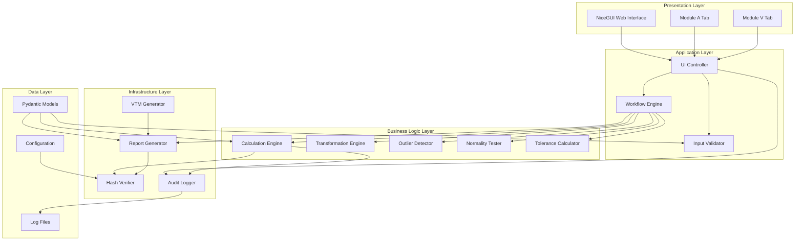
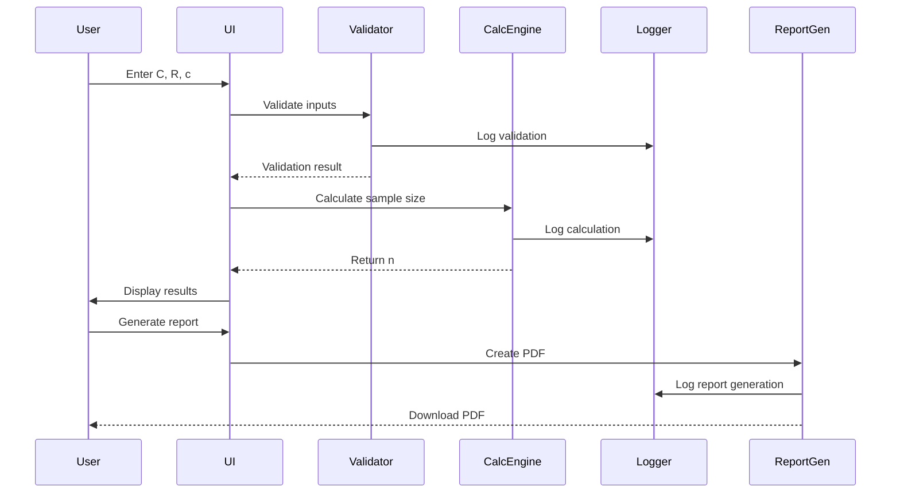
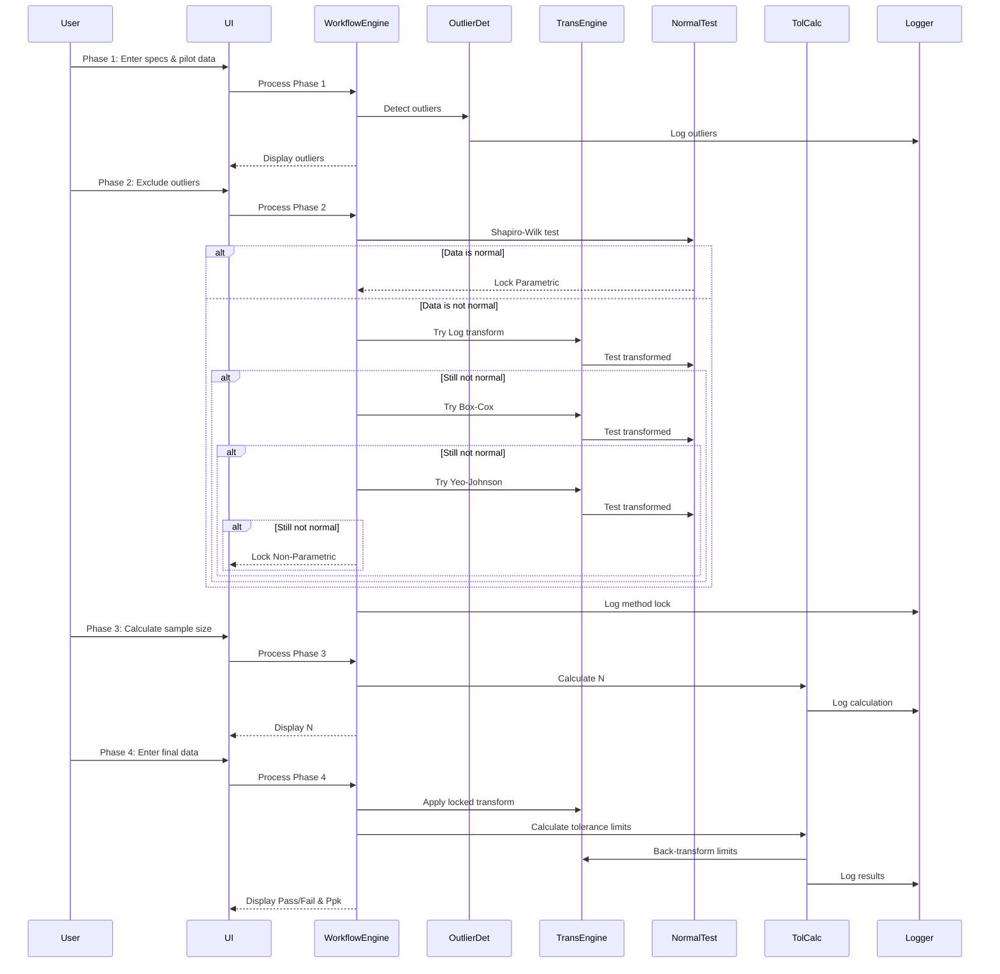

# Design Document: Sample Size Calculator

## Overview

The Sample Size Calculator is a Python-based web application designed for medical device design verification and process validation. It provides statistically rigorous sample size determination and tolerance interval calculation capabilities while maintaining compliance with ISO/TR 80002-2 standards for QMS software.

The system consists of two primary analysis modules:
- **Module A (Attribute Data Analysis)**: Binary Pass/Fail data analysis using Success Run Theorem and Cumulative Binomial Distribution
- **Module V (Variable Data Analysis)**: Continuous measurement analysis with a strict 4-phase sequential workflow including outlier detection, normality testing, transformation cascade, and tolerance interval calculation

The application emphasizes data integrity through SHA-256 hash verification, comprehensive audit trail logging, and automated validation reporting (IQ/OQ/PQ). The system is deployed via Docker Compose and provides a modern web interface built with NiceGUI.

### Key Design Principles

1. **Single Source of Truth**: Pydantic models serve as the canonical data definitions across all system components
2. **Sequential Workflow Enforcement**: UI controls prevent phase-skipping to ensure statistical validity
3. **Method Transparency**: Active mathematical paths are clearly displayed to users
4. **Validation-First**: Hash-based verification ensures calculation engine integrity
5. **Audit Trail**: Comprehensive logging of all user interactions and system events
6. **Reproducibility**: Deterministic calculations with locked transformation methods

## Architecture

### High-Level System Architecture



### Component Interaction Flow

**Module A Flow:**


**Module V Flow (4-Phase):**


### Technology Stack

- **Web Framework**: NiceGUI (Python-based reactive UI framework)
- **Calculation Engine**: NumPy, SciPy (statistical computations)
- **Data Validation**: Pydantic (data models and validation)
- **PDF Generation**: ReportLab (user reports and validation certificates)
- **Testing**: pytest (unit/OQ tests), playwright (UI/PQ tests)
- **Logging**: Python logging module with file handlers
- **Deployment**: Docker Compose
- **Package Management**: uv (with hash-based lockfile)

## Components and Interfaces

### 1. Pydantic Data Models (models.py)

All data structures are defined using Pydantic for validation and type safety.

```python
from pydantic import BaseModel, Field, field_validator
from typing import Optional, Literal
from enum import Enum

class SpecificationType(str, Enum):
    ONE_SIDED = "One-Sided"
    TWO_SIDED = "Two-Sided"

class TransformationMethod(str, Enum):
    NONE = "None"
    LOGARITHMIC = "Logarithmic"
    BOX_COX = "Box-Cox"
    YEO_JOHNSON = "Yeo-Johnson"

class AnalysisMethod(str, Enum):
    PARAMETRIC = "Parametric"
    NON_PARAMETRIC = "Non-Parametric (Wilks)"

# Module A Models
class AttributeInputs(BaseModel):
    confidence: float = Field(gt=0, lt=100, description="Confidence level (%)")
    reliability: float = Field(gt=0, lt=100, description="Reliability level (%)")
    allowable_failures: Optional[int] = Field(ge=0, description="Allowable failures (c)")
    
    @field_validator('allowable_failures')
    def validate_allowable_failures(cls, v):
        if v is not None and v < 0:
            raise ValueError("Allowable failures must be non-negative")
        return v

class AttributeResults(BaseModel):
    sample_size: int
    confidence: float
    reliability: float
    allowable_failures: int
    method: Literal["Success Run Theorem", "Cumulative Binomial"]

class SensitivityAnalysisResults(BaseModel):
    results: list[tuple[int, int]]  # [(c, n), ...]

# Module V Models
class SpecificationLimits(BaseModel):
    spec_type: SpecificationType
    lsl: Optional[float] = None
    usl: Optional[float] = None
    
    @field_validator('lsl', 'usl')
    def validate_limits(cls, v, info):
        spec_type = info.data.get('spec_type')
        if spec_type == SpecificationType.ONE_SIDED:
            if v is None:
                raise ValueError("One-sided spec requires either LSL or USL")
        elif spec_type == SpecificationType.TWO_SIDED:
            if v is None:
                raise ValueError("Two-sided spec requires both LSL and USL")
        return v

class PilotDataInput(BaseModel):
    input_method: Literal["dataset", "statistics"]
    dataset: Optional[list[float]] = None
    estimated_mean: Optional[float] = None
    estimated_std: Optional[float] = None
    
    @field_validator('dataset')
    def validate_dataset(cls, v):
        if v is not None:
            if len(v) < 3:
                raise ValueError("Pilot dataset must contain at least 3 data points")
            if not all(isinstance(x, (int, float)) for x in v):
                raise ValueError("All pilot data values must be numeric")
        return v

class OutlierInfo(BaseModel):
    value: float
    is_excluded: bool = False
    rationale: Optional[str] = None

class Phase1Results(BaseModel):
    pilot_data: list[float]
    outliers: list[OutlierInfo]
    q1: float
    q3: float
    iqr: float

class Phase2Results(BaseModel):
    cleaned_data: list[float]
    shapiro_p_value: float
    transformation_method: TransformationMethod
    analysis_method: AnalysisMethod
    lambda_param: Optional[float] = None
    manual_override: bool = False

class Phase3Results(BaseModel):
    required_sample_size: int
    k_margin: float
    k_factor: float
    specification_type: SpecificationType

class Phase4Results(BaseModel):
    final_data: list[float]
    tolerance_limits: dict[str, float]  # {"lower": x, "upper": y} or {"limit": x}
    pass_fail: Literal["Pass", "Fail"]
    ppk: Optional[float] = None

# Report Models
class CalculationReport(BaseModel):
    timestamp: str
    module: Literal["Module A", "Module V"]
    inputs: dict
    results: dict
    engine_hash: str
    validation_state: bool
    method_path: str

class ValidationCertificate(BaseModel):
    test_date: str
    tester_name: str
    system_info: dict
    test_results: list[dict]  # [{"urs_id": "...", "test_id": "...", "status": "..."}]
    validated_hash: str
```

### 2. Calculation Engine (calculations.py)

Core mathematical computation module with hash verification.

**Interface:**
```python
class CalculationEngine:
    """Core calculation engine for sample size and tolerance interval calculations."""
    
    @staticmethod
    def success_run_theorem(confidence: float, reliability: float) -> int:
        """Calculate sample size using Success Run Theorem (c=0).
        
        Args:
            confidence: Confidence level as percentage (0-100)
            reliability: Reliability level as percentage (0-100)
            
        Returns:
            Required sample size (integer)
        """
        pass
    
    @staticmethod
    def cumulative_binomial(confidence: float, reliability: float, 
                           allowable_failures: int) -> int:
        """Calculate sample size using cumulative binomial distribution (c>0).
        
        Args:
            confidence: Confidence level as percentage (0-100)
            reliability: Reliability level as percentage (0-100)
            allowable_failures: Number of allowable failures (c)
            
        Returns:
            Required sample size (integer)
        """
        pass
    
    @staticmethod
    def sensitivity_analysis(confidence: float, reliability: float) -> list[tuple[int, int]]:
        """Calculate sample sizes for c=0,1,2,3.
        
        Returns:
            List of (c, n) tuples
        """
        pass
    
    @staticmethod
    def one_sided_tolerance_factor(n: int, confidence: float, 
                                   reliability: float) -> float:
        """Calculate one-sided tolerance factor k1 using non-central t-distribution."""
        pass
    
    @staticmethod
    def two_sided_tolerance_factor(n: int, confidence: float, 
                                   reliability: float) -> float:
        """Calculate two-sided tolerance factor k2 using Howe-Guenther approximation."""
        pass
    
    @staticmethod
    def non_parametric_one_sided_sample_size(confidence: float, 
                                            reliability: float) -> int:
        """Calculate non-parametric sample size for one-sided specification."""
        pass
    
    @staticmethod
    def non_parametric_two_sided_sample_size(confidence: float, 
                                            reliability: float) -> int:
        """Calculate non-parametric sample size for two-sided specification."""
        pass
```

**Implementation Notes:**
- All methods are static (no state)
- Uses scipy.stats for statistical distributions
- Implements iterative search for tolerance factors
- Returns integer sample sizes using ceiling function
- Validates inputs using Pydantic models before calculation

### 3. Transformation Engine (transformations.py)

Handles data normalization and transformation cascade.

**Interface:**
```python
class TransformationEngine:
    """Manages data transformations for normality."""
    
    @staticmethod
    def log_transform(data: list[float]) -> Optional[list[float]]:
        """Apply natural logarithm transformation.
        
        Returns None if data contains non-positive values.
        """
        pass
    
    @staticmethod
    def box_cox_transform(data: list[float]) -> Optional[tuple[list[float], float]]:
        """Apply Box-Cox transformation with optimized lambda.
        
        Returns (transformed_data, lambda) or None if data contains non-positive values.
        """
        pass
    
    @staticmethod
    def yeo_johnson_transform(data: list[float]) -> tuple[list[float], float]:
        """Apply Yeo-Johnson transformation with optimized lambda.
        
        Works with zero and negative values.
        """
        pass
    
    @staticmethod
    def inverse_log_transform(data: list[float]) -> list[float]:
        """Back-transform from log space."""
        pass
    
    @staticmethod
    def inverse_box_cox_transform(data: list[float], lambda_param: float) -> list[float]:
        """Back-transform from Box-Cox space."""
        pass
    
    @staticmethod
    def inverse_yeo_johnson_transform(data: list[float], lambda_param: float) -> list[float]:
        """Back-transform from Yeo-Johnson space."""
        pass
    
    @staticmethod
    def transformation_cascade(data: list[float], 
                              manual_method: Optional[TransformationMethod] = None
                              ) -> Phase2Results:
        """Execute transformation cascade with Shapiro-Wilk testing.
        
        If manual_method is provided, skip cascade and use specified method.
        """
        pass
```

### 4. Outlier Detector (outliers.py)

IQR-based outlier detection.

**Interface:**
```python
class OutlierDetector:
    """Detects outliers using IQR method."""
    
    @staticmethod
    def detect_outliers(data: list[float]) -> Phase1Results:
        """Detect outliers using IQR method.
        
        Returns Phase1Results with Q1, Q3, IQR, and flagged outliers.
        """
        pass
    
    @staticmethod
    def apply_exclusions(phase1_results: Phase1Results, 
                        exclusions: list[OutlierInfo]) -> list[float]:
        """Apply user-specified outlier exclusions.
        
        Validates that rationale is provided for each exclusion.
        """
        pass
```

### 5. Normality Tester (normality.py)

Shapiro-Wilk normality testing.

**Interface:**
```python
class NormalityTester:
    """Performs Shapiro-Wilk normality tests."""
    
    @staticmethod
    def shapiro_wilk_test(data: list[float]) -> float:
        """Perform Shapiro-Wilk test.
        
        Returns p-value.
        """
        pass
    
    @staticmethod
    def is_normal(p_value: float, alpha: float = 0.05) -> bool:
        """Determine if data is normal based on p-value."""
        pass
```

### 6. Tolerance Calculator (tolerance.py)

Calculates tolerance intervals and capability metrics.

**Interface:**
```python
class ToleranceCalculator:
    """Calculates tolerance intervals and process capability."""
    
    @staticmethod
    def calculate_capability_margin(data: list[float], 
                                   spec_limits: SpecificationLimits,
                                   transformation_method: TransformationMethod,
                                   lambda_param: Optional[float] = None) -> float:
        """Calculate k_margin from pilot data.
        
        Raises ValueError if process is incapable (k_margin <= 0).
        """
        pass
    
    @staticmethod
    def calculate_required_sample_size(k_margin: float,
                                      confidence: float,
                                      reliability: float,
                                      spec_type: SpecificationType,
                                      analysis_method: AnalysisMethod) -> Phase3Results:
        """Iteratively determine required sample size N."""
        pass
    
    @staticmethod
    def calculate_tolerance_limits(final_data: list[float],
                                  phase2_results: Phase2Results,
                                  phase3_results: Phase3Results,
                                  spec_limits: SpecificationLimits) -> Phase4Results:
        """Calculate final tolerance limits and Pass/Fail determination."""
        pass
    
    @staticmethod
    def calculate_ppk(data: list[float], spec_limits: SpecificationLimits) -> float:
        """Calculate process capability index Ppk."""
        pass
```

### 7. Hash Verifier (hash_verifier.py)

SHA-256 hash calculation and verification.

**Interface:**
```python
class HashVerifier:
    """Manages calculation engine hash verification."""
    
    @staticmethod
    def calculate_file_hash(filepath: str) -> str:
        """Calculate SHA-256 hash of a file."""
        pass
    
    @staticmethod
    def get_engine_hash() -> str:
        """Get current hash of calculations.py."""
        pass
    
    @staticmethod
    def get_validated_hash() -> Optional[str]:
        """Retrieve stored validated hash from config."""
        pass
    
    @staticmethod
    def set_validated_hash(hash_value: str) -> None:
        """Store validated hash to config."""
        pass
    
    @staticmethod
    def is_validated_state() -> bool:
        """Check if current engine hash matches validated hash."""
        pass
```

### 8. Audit Logger (audit_logger.py)

Comprehensive logging of user interactions and system events.

**Interface:**
```python
class AuditLogger:
    """Manages audit trail logging."""
    
    def __init__(self, log_dir: str = "logs"):
        """Initialize logger with daily rotation and 90-day retention."""
        pass
    
    def log_ui_interaction(self, event_type: str, session_id: str, 
                          context: dict) -> None:
        """Log UI interaction event."""
        pass
    
    def log_button_click(self, button_id: str, module: str, 
                        phase: Optional[str], session_id: str) -> None:
        """Log button click event."""
        pass
    
    def log_input_change(self, field_id: str, old_value: any, 
                        new_value: any, validation_result: bool,
                        session_id: str) -> None:
        """Log input field modification."""
        pass
    
    def log_calculation(self, calc_type: str, inputs: dict, 
                       outputs: dict, engine_hash: str,
                       session_id: str) -> None:
        """Log calculation execution."""
        pass
    
    def log_validation_error(self, error_type: str, error_message: str,
                            field_id: str, invalid_value: any,
                            session_id: str) -> None:
        """Log validation error."""
        pass
    
    def log_phase_transition(self, source_phase: str, dest_phase: str,
                            trigger: str, session_id: str) -> None:
        """Log Module V phase transition."""
        pass
    
    def log_method_lock(self, method: str, lambda_param: Optional[float],
                       p_value: float, session_id: str) -> None:
        """Log transformation method lock."""
        pass
    
    def log_outlier_exclusion(self, outlier_value: float, rationale: str,
                             session_id: str) -> None:
        """Log outlier exclusion."""
        pass
    
    def log_report_generation(self, report_type: str, engine_hash: str,
                             validation_state: bool, session_id: str) -> None:
        """Log PDF report generation."""
        pass
```

**Implementation Notes:**
- Uses Python logging module with RotatingFileHandler
- Log files stored in `logs/` directory
- Daily rotation with 90-day retention
- 10MB file size limit before rotation
- ISO 8601 timestamp format
- Structured log format: `[TIMESTAMP] [LEVEL] [SESSION_ID] [EVENT_TYPE] {context_json}`
- Atomic write operations to prevent corruption

### 9. Report Generator (report_generator.py)

PDF report generation using ReportLab.

**Interface:**
```python
class ReportGenerator:
    """Generates PDF reports using ReportLab."""
    
    @staticmethod
    def generate_user_report(report_data: CalculationReport) -> bytes:
        """Generate user calculation report PDF.
        
        Returns PDF as bytes for download.
        """
        pass
    
    @staticmethod
    def generate_validation_certificate(cert_data: ValidationCertificate) -> bytes:
        """Generate validation certificate PDF.
        
        Returns PDF as bytes for download.
        """
        pass
    
    @staticmethod
    def _create_header(canvas, title: str) -> None:
        """Create report header with title."""
        pass
    
    @staticmethod
    def _create_footer(canvas, page_num: int, total_pages: int) -> None:
        """Create report footer with page numbers."""
        pass
    
    @staticmethod
    def _add_hash_section(story: list, engine_hash: str, 
                         validation_state: bool) -> None:
        """Add engine hash and validation state section."""
        pass
```

**Implementation Notes:**
- Uses ReportLab Flowable paragraphs to prevent text overflow
- Includes header/footer on all pages
- Displays engine hash and validation state prominently
- Tables for structured data display
- Includes timestamp and system information

### 10. VTM Generator (vtm_generator.py)

Verification Traceability Matrix generation.

**Interface:**
```python
class VTMGenerator:
    """Generates Verification Traceability Matrix."""
    
    @staticmethod
    def generate_vtm(test_results: list[dict]) -> pd.DataFrame:
        """Generate VTM from test results.
        
        Returns DataFrame with columns: URS_ID, Requirement, Test_ID, Result
        """
        pass
    
    @staticmethod
    def export_vtm_csv(vtm: pd.DataFrame, filepath: str) -> None:
        """Export VTM to CSV file."""
        pass
    
    @staticmethod
    def add_vtm_to_pdf(story: list, vtm: pd.DataFrame) -> None:
        """Add VTM table to PDF report story."""
        pass
```

### 11. UI Controller (ui_controller.py)

NiceGUI-based web interface controller.

**Interface:**
```python
class UIController:
    """Manages NiceGUI web interface."""
    
    def __init__(self):
        """Initialize UI controller with session management."""
        self.logger = AuditLogger()
        self.session_id = self._generate_session_id()
    
    def create_module_a_tab(self) -> None:
        """Create Module A UI tab."""
        pass
    
    def create_module_v_tab(self) -> None:
        """Create Module V UI tab with 4 phases."""
        pass
    
    def _create_phase1_ui(self) -> None:
        """Create Phase 1 UI (specs and pilot data)."""
        pass
    
    def _create_phase2_ui(self) -> None:
        """Create Phase 2 UI (outlier exclusion and transformation)."""
        pass
    
    def _create_phase3_ui(self) -> None:
        """Create Phase 3 UI (sample size calculation)."""
        pass
    
    def _create_phase4_ui(self) -> None:
        """Create Phase 4 UI (final data and tolerance limits)."""
        pass
    
    def _enforce_sequential_workflow(self, current_phase: int) -> None:
        """Enable/disable phase controls based on completion status."""
        pass
    
    def _display_method_transparency(self, method_path: str) -> None:
        """Display active mathematical path."""
        pass
    
    def _add_tooltips(self) -> None:
        """Add contextual tooltips to all statistical terms."""
        pass
    
    def _handle_input_change(self, field_id: str, old_value: any, 
                            new_value: any) -> None:
        """Handle input field changes with validation and logging."""
        pass
    
    def _handle_button_click(self, button_id: str, module: str, 
                            phase: Optional[str]) -> None:
        """Handle button clicks with logging."""
        pass
```

**Implementation Notes:**
- Uses NiceGUI reactive components (ui.input, ui.button, ui.table, etc.)
- Separate tabs for Module A and Module V
- Phase controls disabled until prerequisites met
- Real-time validation feedback
- Tooltips on hover (500ms delay)
- Session-based state management
- Concurrent user session support

## Data Models

All data models are defined using Pydantic in `models.py` as the single source of truth. The models provide:

1. **Type Safety**: Strict type checking at runtime
2. **Validation**: Automatic validation of constraints (ranges, required fields)
3. **Serialization**: JSON serialization for logging and reporting
4. **Documentation**: Field descriptions for tooltips and documentation

### Model Hierarchy

```
BaseModel (Pydantic)
├── AttributeInputs
├── AttributeResults
├── SensitivityAnalysisResults
├── SpecificationLimits
├── PilotDataInput
├── OutlierInfo
├── Phase1Results
├── Phase2Results
├── Phase3Results
├── Phase4Results
├── CalculationReport
└── ValidationCertificate
```

### Validation Rules

- **Confidence/Reliability**: 0 < value < 100
- **Allowable Failures**: value >= 0 (integer)
- **Pilot Dataset**: minimum 3 data points, all numeric
- **Specification Limits**: 
  - One-Sided: requires LSL OR USL
  - Two-Sided: requires both LSL AND USL
- **Outlier Exclusion**: requires non-empty rationale
- **Final Dataset**: size must match calculated N

### Data Flow

```
User Input → Pydantic Validation → Business Logic → Pydantic Results → UI Display
                                                                      ↓
                                                                  Report Generation
                                                                      ↓
                                                                  Audit Logging
```


## Module A Implementation Design

### Overview

Module A provides attribute (binary) data analysis for Pass/Fail scenarios. It implements two calculation methods:
1. **Success Run Theorem** (c=0): For zero-failure scenarios
2. **Cumulative Binomial Distribution** (c>0): For scenarios with allowable failures

### User Interface Layout

```
┌─────────────────────────────────────────────────────────┐
│ Module A: Attribute Data Analysis                       │
├─────────────────────────────────────────────────────────┤
│                                                          │
│ Confidence Level (%): [____] (?)                        │
│ Reliability Level (%): [____] (?)                       │
│ Allowable Failures (c): [____] (?) [Leave empty for     │
│                                      sensitivity analysis]│
│                                                          │
│ [Calculate Sample Size]                                 │
│                                                          │
│ Results:                                                 │
│ ┌────────────────────────────────────────────────────┐ │
│ │ Method: Success Run Theorem / Cumulative Binomial  │ │
│ │ Required Sample Size (n): ___                      │ │
│ │                                                     │ │
│ │ OR (if sensitivity analysis):                      │ │
│ │ ┌──────────────────────────────────────┐          │ │
│ │ │ Allowable Failures (c) │ Sample Size │          │ │
│ │ ├────────────────────────┼─────────────┤          │ │
│ │ │         0              │     __      │          │ │
│ │ │         1              │     __      │          │ │
│ │ │         2              │     __      │          │ │
│ │ │         3              │     __      │          │ │
│ │ └──────────────────────────────────────┘          │ │
│ └────────────────────────────────────────────────────┘ │
│                                                          │
│ [Generate PDF Report]                                   │
│                                                          │
└─────────────────────────────────────────────────────────┘
```

### Calculation Logic

**Success Run Theorem (c=0):**
```python
def success_run_theorem(confidence: float, reliability: float) -> int:
    """
    Formula: n = ceiling(ln(1-C) / ln(R))
    where C and R are expressed as decimals (e.g., 95% = 0.95)
    """
    C = confidence / 100.0
    R = reliability / 100.0
    n = math.ceil(math.log(1 - C) / math.log(R))
    return n
```

**Cumulative Binomial Distribution (c>0):**
```python
def cumulative_binomial(confidence: float, reliability: float, 
                       allowable_failures: int) -> int:
    """
    Find minimum n where:
    sum(k=0 to c) [C(n,k) * (1-R)^k * R^(n-k)] <= 1-C
    
    Uses scipy.stats.binom.cdf for cumulative probability
    """
    C = confidence / 100.0
    R = reliability / 100.0
    c = allowable_failures
    
    # Start with Success Run Theorem result as lower bound
    n = success_run_theorem(confidence, reliability)
    
    # Iterate until constraint is satisfied
    while True:
        cumulative_prob = binom.cdf(c, n, 1 - R)
        if cumulative_prob <= 1 - C:
            return n
        n += 1
```

**Sensitivity Analysis:**
```python
def sensitivity_analysis(confidence: float, reliability: float) -> list[tuple[int, int]]:
    """Calculate sample sizes for c=0,1,2,3"""
    results = []
    for c in [0, 1, 2, 3]:
        if c == 0:
            n = success_run_theorem(confidence, reliability)
        else:
            n = cumulative_binomial(confidence, reliability, c)
        results.append((c, n))
    return results
```

### Validation Rules

1. **Confidence**: 0 < C < 100
2. **Reliability**: 0 < R < 100
3. **Allowable Failures**: c >= 0 (integer) or None (for sensitivity analysis)

### Error Handling

- Invalid input ranges: Display error message, prevent calculation
- Empty confidence/reliability: Display "Required field" message
- Negative allowable failures: Display "Must be non-negative" message

### Report Content

Module A PDF report includes:
- Timestamp
- Input parameters (C, R, c)
- Calculation method used
- Calculated sample size(s)
- Engine hash
- Validation state

## Module V Implementation Design

### Overview

Module V provides variable (continuous) data analysis with a strict 4-phase sequential workflow:
1. **Phase 1**: Specification definition and pilot data input with outlier detection
2. **Phase 2**: Outlier exclusion and transformation cascade
3. **Phase 3**: Sample size calculation
4. **Phase 4**: Final data input and tolerance interval calculation

### Phase 1: Specification Definition and Pilot Data Input

**UI Layout:**
```
┌─────────────────────────────────────────────────────────┐
│ Phase 1: Specification Definition & Pilot Data          │
├─────────────────────────────────────────────────────────┤
│                                                          │
│ Specification Type: (•) One-Sided  ( ) Two-Sided        │
│                                                          │
│ Lower Specification Limit (LSL): [____] (?)             │
│ Upper Specification Limit (USL): [____] (?)             │
│                                                          │
│ Confidence Level (%): [____] (?)                        │
│ Reliability Level (%): [____] (?)                       │
│                                                          │
│ Pilot Data Input Method:                                │
│ (•) Dataset  ( ) Estimated Statistics                   │
│                                                          │
│ [If Dataset selected:]                                  │
│ Pilot Dataset (comma-separated): [________________] (?) │
│                                                          │
│ [If Estimated Statistics selected:]                     │
│ Estimated Mean: [____] (?)                              │
│ Estimated Std Dev: [____] (?)                           │
│                                                          │
│ [Analyze Pilot Data]                                    │
│                                                          │
│ Outliers Detected (IQR Method):                         │
│ ┌────────────────────────────────────────────────────┐ │
│ │ Q1: ___  Q3: ___  IQR: ___                         │ │
│ │                                                     │ │
│ │ Outlier Values:                                    │ │
│ │ • Value: ___ (below Q1 - 1.5*IQR)                 │ │
│ │ • Value: ___ (above Q3 + 1.5*IQR)                 │ │
│ └────────────────────────────────────────────────────┘ │
│                                                          │
│ ⚠ Warning: Pilot dataset contains fewer than 30 data   │
│   points. For reliable variance estimation, use 12-30   │
│   samples.                                              │
│                                                          │
└─────────────────────────────────────────────────────────┘
```

**Logic:**
1. Validate specification type and limits
2. Validate pilot data (minimum 3 points, all numeric)
3. Calculate Q1, Q3, IQR using numpy.percentile
4. Flag outliers: value < Q1 - 1.5*IQR or value > Q3 + 1.5*IQR
5. Display warning if dataset size < 30
6. Enable Phase 2 upon completion

### Phase 2: Outlier Exclusion and Transformation Cascade

**UI Layout:**
```
┌─────────────────────────────────────────────────────────┐
│ Phase 2: Outlier Exclusion & Normality Testing          │
├─────────────────────────────────────────────────────────┤
│                                                          │
│ Detected Outliers:                                      │
│ ┌────────────────────────────────────────────────────┐ │
│ │ Value: 123.45  [☐ Exclude]                         │ │
│ │ Rationale: [_______________________________] (?)   │ │
│ │                                                     │ │
│ │ Value: 456.78  [☐ Exclude]                         │ │
│ │ Rationale: [_______________________________] (?)   │ │
│ └────────────────────────────────────────────────────┘ │
│                                                          │
│ Manual Transformation Override:                         │
│ [☐ Enable Manual Override]                             │
│ [ ] None (Parametric)                                   │
│ [ ] Logarithmic                                         │
│ [ ] Box-Cox                                             │
│ [ ] Yeo-Johnson                                         │
│ [ ] Non-Parametric (Wilks)                             │
│                                                          │
│ [Process Normality Testing]                             │
│                                                          │
│ Transformation Cascade Results:                         │
│ ┌────────────────────────────────────────────────────┐ │
│ │ Original Data:                                     │ │
│ │   Shapiro-Wilk p-value: 0.023 (Not Normal)        │ │
│ │                                                     │ │
│ │ Logarithmic Transform:                             │ │
│ │   Shapiro-Wilk p-value: 0.087 (Normal) ✓          │ │
│ │                                                     │ │
│ │ LOCKED METHOD: Logarithmic                         │ │
│ │ Analysis Method: Parametric                        │ │
│ └────────────────────────────────────────────────────┘ │
│                                                          │
└─────────────────────────────────────────────────────────┘
```

**Transformation Cascade Logic:**

```python
def transformation_cascade(data: list[float], 
                          manual_method: Optional[TransformationMethod] = None
                          ) -> Phase2Results:
    """
    Execute transformation cascade with Shapiro-Wilk testing.
    
    Cascade order:
    1. Test original data
    2. If not normal and all values > 0: Try Log
    3. If still not normal and all values > 0: Try Box-Cox
    4. If still not normal: Try Yeo-Johnson
    5. If still not normal: Lock Non-Parametric
    
    If manual_method is provided, skip cascade and use specified method.
    """
    
    if manual_method:
        return _apply_manual_method(data, manual_method)
    
    # Test original data
    p_value = shapiro_wilk_test(data)
    if p_value > 0.05:
        return Phase2Results(
            cleaned_data=data,
            shapiro_p_value=p_value,
            transformation_method=TransformationMethod.NONE,
            analysis_method=AnalysisMethod.PARAMETRIC,
            lambda_param=None,
            manual_override=False
        )
    
    # Try Logarithmic
    if all(x > 0 for x in data):
        log_data = [math.log(x) for x in data]
        p_value = shapiro_wilk_test(log_data)
        if p_value > 0.05:
            return Phase2Results(
                cleaned_data=log_data,
                shapiro_p_value=p_value,
                transformation_method=TransformationMethod.LOGARITHMIC,
                analysis_method=AnalysisMethod.PARAMETRIC,
                lambda_param=None,
                manual_override=False
            )
    
    # Try Box-Cox
    if all(x > 0 for x in data):
        boxcox_data, lambda_param = boxcox(data)
        p_value = shapiro_wilk_test(boxcox_data)
        if p_value > 0.05:
            return Phase2Results(
                cleaned_data=boxcox_data,
                shapiro_p_value=p_value,
                transformation_method=TransformationMethod.BOX_COX,
                analysis_method=AnalysisMethod.PARAMETRIC,
                lambda_param=lambda_param,
                manual_override=False
            )
    
    # Try Yeo-Johnson
    yeojohnson_data, lambda_param = yeojohnson(data)
    p_value = shapiro_wilk_test(yeojohnson_data)
    if p_value > 0.05:
        return Phase2Results(
            cleaned_data=yeojohnson_data,
            shapiro_p_value=p_value,
            transformation_method=TransformationMethod.YEO_JOHNSON,
            analysis_method=AnalysisMethod.PARAMETRIC,
            lambda_param=lambda_param,
            manual_override=False
        )
    
    # Fallback to Non-Parametric
    return Phase2Results(
        cleaned_data=data,
        shapiro_p_value=p_value,
        transformation_method=TransformationMethod.NONE,
        analysis_method=AnalysisMethod.NON_PARAMETRIC,
        lambda_param=None,
        manual_override=False
    )
```

**Manual Override Logic:**
- When enabled, user can select any transformation method
- System validates data compatibility (e.g., Log/Box-Cox require positive values)
- Selected method is locked regardless of Shapiro-Wilk result
- Manual override flag is set to True in Phase2Results

### Phase 3: Sample Size Calculation

**UI Layout:**
```
┌─────────────────────────────────────────────────────────┐
│ Phase 3: Sample Size Calculation                        │
├─────────────────────────────────────────────────────────┤
│                                                          │
│ Active Method: Parametric (Logarithmic Transform)       │
│ Specification Type: Two-Sided                           │
│                                                          │
│ [Calculate Required Sample Size]                        │
│                                                          │
│ Results:                                                 │
│ ┌────────────────────────────────────────────────────┐ │
│ │ Capability Margin (k_margin): 2.45                 │ │
│ │ Tolerance Factor (k2): 2.38                        │ │
│ │ Required Sample Size (N): 15                       │ │
│ │                                                     │ │
│ │ Formula Used: Howe-Guenther Approximation          │ │
│ └────────────────────────────────────────────────────┘ │
│                                                          │
└─────────────────────────────────────────────────────────┘
```

**Calculation Logic:**

```python
def calculate_required_sample_size(k_margin: float,
                                  confidence: float,
                                  reliability: float,
                                  spec_type: SpecificationType,
                                  analysis_method: AnalysisMethod) -> Phase3Results:
    """
    Iteratively determine required sample size N.
    """
    
    if analysis_method == AnalysisMethod.NON_PARAMETRIC:
        if spec_type == SpecificationType.ONE_SIDED:
            N = non_parametric_one_sided_sample_size(confidence, reliability)
            k_factor = None  # Uses extreme order statistics
        else:
            N = non_parametric_two_sided_sample_size(confidence, reliability)
            k_factor = None
    else:  # Parametric
        N = 3  # Start with minimum sample size
        while True:
            if spec_type == SpecificationType.ONE_SIDED:
                k_factor = one_sided_tolerance_factor(N, confidence, reliability)
            else:
                k_factor = two_sided_tolerance_factor(N, confidence, reliability)
            
            if k_factor <= k_margin:
                break
            N += 1
            
            if N > 10000:  # Safety limit
                raise ValueError("Sample size calculation did not converge")
    
    return Phase3Results(
        required_sample_size=N,
        k_margin=k_margin,
        k_factor=k_factor,
        specification_type=spec_type
    )
```

**Capability Margin Calculation:**

```python
def calculate_capability_margin(data: list[float], 
                               spec_limits: SpecificationLimits,
                               transformation_method: TransformationMethod,
                               lambda_param: Optional[float] = None) -> float:
    """
    Calculate k_margin from pilot data.
    
    Steps:
    1. Forward-transform specification limits (if transformed)
    2. Calculate distance from mean to each spec limit
    3. Divide by standard deviation
    4. Return minimum distance
    """
    
    mean = np.mean(data)
    std = np.std(data, ddof=1)
    
    # Forward-transform spec limits
    if transformation_method == TransformationMethod.LOGARITHMIC:
        lsl_t = math.log(spec_limits.lsl) if spec_limits.lsl else None
        usl_t = math.log(spec_limits.usl) if spec_limits.usl else None
    elif transformation_method == TransformationMethod.BOX_COX:
        lsl_t = ((spec_limits.lsl ** lambda_param) - 1) / lambda_param if spec_limits.lsl else None
        usl_t = ((spec_limits.usl ** lambda_param) - 1) / lambda_param if spec_limits.usl else None
    elif transformation_method == TransformationMethod.YEO_JOHNSON:
        lsl_t = _yeo_johnson_forward(spec_limits.lsl, lambda_param) if spec_limits.lsl else None
        usl_t = _yeo_johnson_forward(spec_limits.usl, lambda_param) if spec_limits.usl else None
    else:
        lsl_t = spec_limits.lsl
        usl_t = spec_limits.usl
    
    # Calculate capability margins
    margins = []
    if lsl_t is not None:
        margins.append((mean - lsl_t) / std)
    if usl_t is not None:
        margins.append((usl_t - mean) / std)
    
    k_margin = min(margins)
    
    if k_margin <= 0:
        raise ValueError("Process is incapable: k_margin <= 0. "
                        "Mean is outside specification limits.")
    
    return k_margin
```

### Phase 4: Final Data Input and Tolerance Interval Calculation

**UI Layout:**
```
┌─────────────────────────────────────────────────────────┐
│ Phase 4: Final Validation Data & Tolerance Limits       │
├─────────────────────────────────────────────────────────┤
│                                                          │
│ Required Sample Size: 15                                │
│ Locked Method: Parametric (Logarithmic Transform)       │
│                                                          │
│ Final Validation Dataset (comma-separated):             │
│ [_____________________________________________] (?)     │
│                                                          │
│ [Calculate Tolerance Limits]                            │
│                                                          │
│ Results:                                                 │
│ ┌────────────────────────────────────────────────────┐ │
│ │ Transformed Space:                                 │ │
│ │   Mean: 4.523                                      │ │
│ │   Std Dev: 0.234                                   │ │
│ │   Lower Tolerance Limit: 3.966                     │ │
│ │   Upper Tolerance Limit: 5.080                     │ │
│ │                                                     │ │
│ │ Original Space (Back-Transformed):                 │ │
│ │   Lower Tolerance Limit: 52.7                      │ │
│ │   Upper Tolerance Limit: 161.3                     │ │
│ │                                                     │ │
│ │ Specification Limits:                              │ │
│ │   LSL: 50.0                                        │ │
│ │   USL: 200.0                                       │ │
│ │                                                     │ │
│ │ Result: PASS ✓                                     │ │
│ │ Process Capability (Ppk): 1.23                     │ │
│ └────────────────────────────────────────────────────┘ │
│                                                          │
│ [Generate PDF Report]                                   │
│                                                          │
└─────────────────────────────────────────────────────────┘
```

**Calculation Logic:**

```python
def calculate_tolerance_limits(final_data: list[float],
                              phase2_results: Phase2Results,
                              phase3_results: Phase3Results,
                              spec_limits: SpecificationLimits) -> Phase4Results:
    """
    Calculate final tolerance limits and Pass/Fail determination.
    """
    
    # Validate dataset size
    if len(final_data) != phase3_results.required_sample_size:
        raise ValueError(f"Final dataset must contain exactly "
                        f"{phase3_results.required_sample_size} data points")
    
    # Apply locked transformation
    if phase2_results.transformation_method == TransformationMethod.LOGARITHMIC:
        transformed_data = [math.log(x) for x in final_data]
    elif phase2_results.transformation_method == TransformationMethod.BOX_COX:
        transformed_data = boxcox(final_data, lmbda=phase2_results.lambda_param)
    elif phase2_results.transformation_method == TransformationMethod.YEO_JOHNSON:
        transformed_data = yeojohnson(final_data, lmbda=phase2_results.lambda_param)
    else:
        transformed_data = final_data
    
    # Calculate tolerance limits
    if phase2_results.analysis_method == AnalysisMethod.NON_PARAMETRIC:
        # Use extreme order statistics
        if phase3_results.specification_type == SpecificationType.ONE_SIDED:
            if spec_limits.lsl is not None:
                tolerance_limits = {"lower": min(final_data)}
            else:
                tolerance_limits = {"upper": max(final_data)}
        else:
            tolerance_limits = {
                "lower": min(final_data),
                "upper": max(final_data)
            }
    else:  # Parametric
        mean_t = np.mean(transformed_data)
        std_t = np.std(transformed_data, ddof=1)
        k = phase3_results.k_factor
        
        if phase3_results.specification_type == SpecificationType.ONE_SIDED:
            if spec_limits.lsl is not None:
                limit_t = mean_t - k * std_t
                tolerance_limits = {"lower": limit_t}
            else:
                limit_t = mean_t + k * std_t
                tolerance_limits = {"upper": limit_t}
        else:
            lower_t = mean_t - k * std_t
            upper_t = mean_t + k * std_t
            tolerance_limits = {"lower": lower_t, "upper": upper_t}
        
        # Back-transform limits
        if phase2_results.transformation_method == TransformationMethod.LOGARITHMIC:
            tolerance_limits = {key: math.exp(val) for key, val in tolerance_limits.items()}
        elif phase2_results.transformation_method == TransformationMethod.BOX_COX:
            lmbda = phase2_results.lambda_param
            tolerance_limits = {
                key: (lmbda * val + 1) ** (1 / lmbda) 
                for key, val in tolerance_limits.items()
            }
        elif phase2_results.transformation_method == TransformationMethod.YEO_JOHNSON:
            tolerance_limits = {
                key: _yeo_johnson_inverse(val, phase2_results.lambda_param)
                for key, val in tolerance_limits.items()
            }
    
    # Pass/Fail determination
    pass_fail = "Pass"
    if "lower" in tolerance_limits and spec_limits.lsl is not None:
        if tolerance_limits["lower"] < spec_limits.lsl:
            pass_fail = "Fail"
    if "upper" in tolerance_limits and spec_limits.usl is not None:
        if tolerance_limits["upper"] > spec_limits.usl:
            pass_fail = "Fail"
    
    # Calculate Ppk (only for parametric methods)
    ppk = None
    if phase2_results.analysis_method == AnalysisMethod.PARAMETRIC:
        ppk = calculate_ppk(final_data, spec_limits)
    
    return Phase4Results(
        final_data=final_data,
        tolerance_limits=tolerance_limits,
        pass_fail=pass_fail,
        ppk=ppk
    )
```

### Sequential Workflow Enforcement

**State Management:**
```python
class ModuleVState:
    """Manages Module V workflow state."""
    
    def __init__(self):
        self.phase1_complete = False
        self.phase2_complete = False
        self.phase3_complete = False
        self.phase4_complete = False
        
        self.phase1_results: Optional[Phase1Results] = None
        self.phase2_results: Optional[Phase2Results] = None
        self.phase3_results: Optional[Phase3Results] = None
        self.phase4_results: Optional[Phase4Results] = None
    
    def complete_phase1(self, results: Phase1Results) -> None:
        """Mark Phase 1 complete and enable Phase 2."""
        self.phase1_results = results
        self.phase1_complete = True
        # Clear downstream phases
        self.phase2_complete = False
        self.phase3_complete = False
        self.phase4_complete = False
        self.phase2_results = None
        self.phase3_results = None
        self.phase4_results = None
    
    def complete_phase2(self, results: Phase2Results) -> None:
        """Mark Phase 2 complete and enable Phase 3."""
        self.phase2_results = results
        self.phase2_complete = True
        # Clear downstream phases
        self.phase3_complete = False
        self.phase4_complete = False
        self.phase3_results = None
        self.phase4_results = None
    
    def complete_phase3(self, results: Phase3Results) -> None:
        """Mark Phase 3 complete and enable Phase 4."""
        self.phase3_results = results
        self.phase3_complete = True
        # Clear downstream phase
        self.phase4_complete = False
        self.phase4_results = None
    
    def complete_phase4(self, results: Phase4Results) -> None:
        """Mark Phase 4 complete."""
        self.phase4_results = results
        self.phase4_complete = True
    
    def is_phase_enabled(self, phase: int) -> bool:
        """Check if a phase is enabled."""
        if phase == 1:
            return True
        elif phase == 2:
            return self.phase1_complete
        elif phase == 3:
            return self.phase2_complete
        elif phase == 4:
            return self.phase3_complete
        return False
```

**UI Control Logic:**
```python
def _enforce_sequential_workflow(self, current_phase: int) -> None:
    """Enable/disable phase controls based on completion status."""
    
    # Phase 2 controls
    if self.state.is_phase_enabled(2):
        self.phase2_container.enable()
    else:
        self.phase2_container.disable()
    
    # Phase 3 controls
    if self.state.is_phase_enabled(3):
        self.phase3_container.enable()
    else:
        self.phase3_container.disable()
    
    # Phase 4 controls
    if self.state.is_phase_enabled(4):
        self.phase4_container.enable()
    else:
        self.phase4_container.disable()
```

### Method Transparency Display

**Display Format:**
```
Active Mathematical Path:
━━━━━━━━━━━━━━━━━━━━━━━━━━━━━━━━━━━━━━━━━━━━━━━━━━━━━━━━━━━━━━━━━━━━━━━━
Specification Type: Two-Sided
Transformation: Logarithmic (Natural Log)
Analysis Method: Parametric
Tolerance Factor: k2 (Howe-Guenther Approximation)
Formula: Limits = exp(mean_log ± k2 * std_log)
━━━━━━━━━━━━━━━━━━━━━━━━━━━━━━━━━━━━━━━━━━━━━━━━━━━━━━━━━━━━━━━━━━━━━━━━
```

This display updates dynamically as the user progresses through phases.


## Error Handling

### Input Validation Errors

**Module A:**
- Confidence/Reliability out of range (0-100): Display error message "Value must be between 0 and 100"
- Negative allowable failures: Display error message "Allowable failures must be non-negative"
- Non-numeric input: Display error message "Please enter a valid number"
- Empty required fields: Display error message "This field is required"

**Module V:**
- Pilot dataset < 3 points: Display error message "Pilot dataset must contain at least 3 data points"
- Non-numeric pilot data: Display error message "All pilot data values must be numeric"
- Missing specification limits: Display error message "Please define specification limits based on selected type"
- Final dataset size mismatch: Display error message "Final dataset must contain exactly N data points"
- Simultaneous pilot data and statistics: Display error message "Please use only one input method"

### Calculation Errors

- **Process Incapability (k_margin <= 0)**: Display FATAL ERROR message "Process is incapable: mean is outside specification limits. Cannot proceed with sample size calculation."
- **Transformation validation failure**: Display error message "Selected transformation cannot be applied to this data (e.g., Log/Box-Cox require positive values)"
- **Convergence failure**: Display error message "Sample size calculation did not converge (N > 10000). Please review input parameters."
- **Outlier exclusion without rationale**: Display error message "Engineering rationale is required to exclude outliers"

### System Errors

- **Hash verification failure**: Display warning in report "VALIDATED STATE: NO - UNVERIFIED CHANGE"
- **File I/O errors**: Log error and display message "Unable to generate report. Please try again."
- **Log file write errors**: Use atomic write operations with fallback to stderr
- **Dependency version mismatch**: Validation suite fails with clear error message

### Error Logging

All errors are logged to the audit trail with:
- Timestamp (ISO 8601 format)
- Error level (ERROR)
- Session ID
- Error type and message
- Context (field ID, invalid value, etc.)

## Testing Strategy

### Dual Testing Approach

The system employs both unit testing and property-based testing for comprehensive coverage:

**Unit Tests (pytest):**
- Specific examples demonstrating correct behavior
- Edge cases (empty datasets, boundary values, zero/negative values)
- Error conditions and validation failures
- Integration points between components
- UI interaction scenarios (playwright)

**Property-Based Tests (Hypothesis):**
- Universal properties that hold for all valid inputs
- Randomized input generation (100+ iterations per property)
- Comprehensive input space coverage
- Regression detection across input ranges

### Property-Based Testing Configuration

**Library**: Hypothesis (Python property-based testing library)

**Configuration**:
```python
from hypothesis import given, settings, strategies as st

@settings(max_examples=100)
@given(
    confidence=st.floats(min_value=0.01, max_value=99.99),
    reliability=st.floats(min_value=0.01, max_value=99.99)
)
def test_property_name(confidence, reliability):
    """
    Feature: sample-size-calculator, Property X: [property text]
    """
    # Test implementation
    pass
```

**Tagging Convention**:
Each property test includes a docstring with the format:
```
Feature: sample-size-calculator, Property {number}: {property_text}
```

### Test Organization

```
tests/
├── unit/
│   ├── test_calculations.py          # Calculation engine unit tests
│   ├── test_transformations.py       # Transformation engine unit tests
│   ├── test_outliers.py              # Outlier detection unit tests
│   ├── test_normality.py             # Normality testing unit tests
│   ├── test_tolerance.py             # Tolerance calculation unit tests
│   ├── test_hash_verifier.py         # Hash verification unit tests
│   ├── test_audit_logger.py          # Logging unit tests
│   └── test_report_generator.py      # Report generation unit tests
├── property/
│   ├── test_module_a_properties.py   # Module A property tests
│   ├── test_module_v_properties.py   # Module V property tests
│   ├── test_transformation_properties.py  # Transformation property tests
│   └── test_tolerance_properties.py  # Tolerance calculation property tests
├── integration/
│   ├── test_module_a_workflow.py     # Module A end-to-end tests
│   └── test_module_v_workflow.py     # Module V 4-phase workflow tests
├── validation/
│   ├── test_iq.py                    # Installation Qualification tests
│   ├── test_oq.py                    # Operational Qualification tests
│   └── test_pq.py                    # Performance Qualification tests (playwright)
└── conftest.py                        # Pytest fixtures and configuration
```

### Validation Testing (IQ/OQ/PQ)

**Installation Qualification (IQ):**
- Verify uv.lock file integrity
- Verify scipy version 1.x.x installed
- Verify all required dependencies present
- Verify Docker image builds successfully
- Verify docker compose deployment succeeds

**Operational Qualification (OQ):**
- Verify all mathematical formulas against known standard values
- Test Success Run Theorem with published examples
- Test cumulative binomial with published examples
- Test tolerance factors against statistical tables
- Test transformation round-trip properties
- Each test linked to URS ID using pytest markers:
  ```python
  @pytest.mark.urs("REQ-001")
  def test_success_run_theorem_known_values():
      pass
  ```

**Performance Qualification (PQ):**
- End-to-end UI testing with playwright
- Complete Module A workflow (input → calculate → report)
- Complete Module V workflow (Phase 1 → 2 → 3 → 4 → report)
- Verify calculated values appear correctly in UI
- Verify PDF report generation and content
- Verify hash verification in reports
- Verify audit trail logging

### Test Execution

**Local Development:**
```bash
# Run all tests quietly
uv run pytest -q

# Run specific test category
uv run pytest tests/unit/ -q
uv run pytest tests/property/ -q

# Run tests for specific module
uv run pytest -k "module_a" -q

# Run validation suite
uv run pytest tests/validation/ -q
```

**CI/CD:**
```bash
# Run all tests with coverage
uv run pytest --cov=src --cov-report=html --tb=short -q

# Run validation suite and generate VTM
uv run pytest tests/validation/ --json-report --json-report-file=validation_results.json
```

### Coverage Goals

- Unit test coverage: >90%
- Property test coverage: All correctness properties implemented
- Validation coverage: All 38 requirements linked to tests
- UI test coverage: All user workflows tested end-to-end


## Acceptance Criteria Testing Prework

This section analyzes each acceptance criterion to determine testability as a property, example, edge case, or not testable.

### Requirement 1: Attribute Data Input Validation

1.1 WHEN a user enters a confidence value, THE System SHALL validate that the value is greater than 0 and less than 100
  Thoughts: This is testing input validation across all possible confidence values. We can generate random values and test that valid ones pass and invalid ones fail.
  Testable: yes - property

1.2 WHEN a user enters a reliability value, THE System SHALL validate that the value is greater than 0 and less than 100
  Thoughts: This is testing input validation across all possible reliability values. We can generate random values and test that valid ones pass and invalid ones fail.
  Testable: yes - property

1.3 WHEN a user enters an allowable failures value, THE System SHALL validate that the value is a non-negative integer
  Thoughts: This is testing input validation for allowable failures. We can generate random integers and test validation.
  Testable: yes - property

1.4 IF a user enters an invalid parameter value, THEN THE System SHALL display a descriptive error message and prevent calculation
  Thoughts: This is testing error handling behavior across all invalid inputs. We can generate invalid inputs and verify error messages appear.
  Testable: yes - property

1.5 THE Module_A SHALL accept confidence, reliability, and allowable failures as input parameters
  Thoughts: This is a structural requirement about what inputs the module accepts, not a behavioral property we can test.
  Testable: no

### Requirement 2: Success Run Theorem Calculation

2.1 WHEN allowable failures equals zero, THE Calculation_Engine SHALL compute sample size using the formula n = ceiling(ln(1-C)/ln(R))
  Thoughts: This is testing that the calculation follows a specific formula for all valid C and R values. We can generate random C and R values and verify the formula is applied correctly.
  Testable: yes - property

2.2 THE Calculation_Engine SHALL return an integer sample size value
  Thoughts: This is testing that the output type is always an integer for all inputs.
  Testable: yes - property

2.3 FOR ALL valid confidence and reliability inputs with c=0, calculating then recalculating with the same inputs SHALL produce identical results (idempotence property)
  Thoughts: This is explicitly an idempotence property - calling the function twice with the same inputs should give the same result.
  Testable: yes - property

2.4 THE Module_A SHALL display the calculated sample size to the user
  Thoughts: This is a UI display requirement, not a computational property.
  Testable: no


### Requirement 3: Cumulative Binomial Distribution Calculation

3.1 WHEN allowable failures is greater than zero, THE Calculation_Engine SHALL compute the minimum sample size where the cumulative binomial probability is less than or equal to 1-C
  Thoughts: This is testing that the calculation correctly finds the minimum n for all valid inputs with c>0. We can generate random C, R, and c values and verify the constraint is satisfied.
  Testable: yes - property

3.2 THE Calculation_Engine SHALL iterate to find the smallest n satisfying the cumulative binomial constraint
  Thoughts: This is testing that the result is the minimum value, not just any value that satisfies the constraint. We can verify that n-1 does not satisfy the constraint.
  Testable: yes - property

3.3 THE Calculation_Engine SHALL use the formula: sum from k=0 to c of [C(n,k) * (1-R)^k * R^(n-k)] <= 1-C
  Thoughts: This is testing that the specific formula is used. We can verify the calculation matches the formula for all inputs.
  Testable: yes - property

3.4 FOR ALL valid inputs with c>0, the calculated sample size SHALL be greater than or equal to the sample size for c=0 with the same C and R (monotonicity property)
  Thoughts: This is explicitly a monotonicity property - as c increases, n should not decrease.
  Testable: yes - property

### Requirement 4: Sensitivity Analysis for Allowable Failures

4.1 WHEN the allowable failures input is empty, THE Module_A SHALL automatically calculate sample sizes for c=0, c=1, c=2, and c=3
  Thoughts: This is testing a specific behavior when input is empty. This is an example case.
  Testable: yes - example

4.2 THE Module_A SHALL display results in a table with two columns: allowable failures (c) and required sample size (n)
  Thoughts: This is a UI display requirement about table structure.
  Testable: no

4.3 THE System SHALL display all four calculations simultaneously
  Thoughts: This is a UI display requirement about showing multiple results.
  Testable: no

4.4 FOR ALL sensitivity analysis results, sample sizes SHALL be monotonically non-decreasing as c increases (monotonicity property)
  Thoughts: This is explicitly a monotonicity property for the sensitivity analysis results.
  Testable: yes - property

### Requirement 5: Specification Constraint Definition

5.1 WHEN using Module_V, THE System SHALL require the user to select either One-Sided or Two-Sided specification type
  Thoughts: This is testing that the UI enforces selection of specification type.
  Testable: yes - example

5.2 IF One-Sided is selected, THEN THE System SHALL require either LSL or USL to be defined
  Thoughts: This is testing validation logic for one-sided specifications across all possible inputs.
  Testable: yes - property

5.3 IF Two-Sided is selected, THEN THE System SHALL require both LSL and USL to be defined
  Thoughts: This is testing validation logic for two-sided specifications across all possible inputs.
  Testable: yes - property

5.4 THE System SHALL prevent progression to Phase 2 until specification constraints are fully defined
  Thoughts: This is testing workflow enforcement - a specific UI behavior.
  Testable: yes - example

5.5 WHEN specification type is changed, THE System SHALL clear all downstream calculation results
  Thoughts: This is testing that changing inputs clears dependent results. This is a UI state management property.
  Testable: yes - property


### Requirement 6: Pilot Data Input and Validation

6.1 THE Module_V SHALL accept a pilot dataset of continuous numeric values as the primary input method
  Thoughts: This is a structural requirement about what inputs are accepted.
  Testable: no

6.2 THE Module_V SHALL accept estimated mean and standard deviation as an alternative input method
  Thoughts: This is a structural requirement about alternative input methods.
  Testable: no

6.3 THE System SHALL validate that all pilot data values are numeric
  Thoughts: This is testing input validation across all possible pilot datasets. We can generate datasets with mixed types and verify validation.
  Testable: yes - property

6.4 THE System SHALL require a minimum of 3 data points in the pilot dataset
  Thoughts: This is testing validation for dataset size. We can generate datasets of various sizes and verify the constraint.
  Testable: yes - property

6.5 WHEN pilot data contains fewer than 30 datapoints, THE System SHALL display a validation warning
  Thoughts: This is testing that a warning appears for datasets with size < 30. This is an edge case we want to ensure is handled.
  Testable: edge-case

6.6 IF invalid data is entered, THEN THE System SHALL display a descriptive error message
  Thoughts: This is testing error handling for all invalid inputs.
  Testable: yes - property

6.7 THE System SHALL store the pilot dataset or estimated statistics for use in subsequent phases
  Thoughts: This is testing state management - that data persists across phases.
  Testable: yes - property

6.8 THE System SHALL prevent simultaneous use of both pilot data and estimated statistics input methods
  Thoughts: This is testing mutual exclusion validation logic.
  Testable: yes - property

### Requirement 7: Outlier Detection Using IQR Method

7.1 WHEN pilot data is provided, THE Outlier_Detector SHALL calculate Q1, Q3, and IQR from the dataset
  Thoughts: This is testing that the IQR calculation is performed correctly for all datasets. We can generate random datasets and verify the calculations.
  Testable: yes - property

7.2 THE Outlier_Detector SHALL flag values less than Q1 - 1.5 * IQR as outliers
  Thoughts: This is testing the lower outlier detection formula for all datasets.
  Testable: yes - property

7.3 THE Outlier_Detector SHALL flag values greater than Q3 + 1.5 * IQR as outliers
  Thoughts: This is testing the upper outlier detection formula for all datasets.
  Testable: yes - property

7.4 THE System SHALL display all detected outliers to the user with their values
  Thoughts: This is a UI display requirement.
  Testable: no

7.5 FOR ALL datasets, the IQR method SHALL identify the same outliers when applied multiple times (idempotence property)
  Thoughts: This is explicitly an idempotence property - running outlier detection twice should give the same results.
  Testable: yes - property

### Requirement 8: Outlier Exclusion with Engineering Rationale

8.1 WHEN an outlier is detected, THE System SHALL allow the user to exclude it from analysis
  Thoughts: This is a UI capability requirement.
  Testable: no

8.2 IF a user excludes an outlier, THEN THE System SHALL require entry of an engineering rationale text
  Thoughts: This is testing validation that rationale is required for all exclusions.
  Testable: yes - property

8.3 THE System SHALL prevent outlier exclusion without a non-empty rationale
  Thoughts: This is testing validation that empty rationales are rejected for all exclusion attempts.
  Testable: yes - property

8.4 THE System SHALL permanently flag excluded outliers and their rationales in the final report
  Thoughts: This is testing that exclusions are recorded in reports. This is a reporting requirement.
  Testable: yes - example

8.5 THE System SHALL recalculate all statistics using the cleaned dataset after exclusions
  Thoughts: This is testing that statistics are updated after exclusions for all datasets.
  Testable: yes - property


### Requirement 9: Shapiro-Wilk Normality Testing

9.1 WHEN Phase 2 is initiated, THE Normality_Tester SHALL perform a Shapiro-Wilk test on the cleaned pilot dataset
  Thoughts: This is testing that the test is performed for all cleaned datasets.
  Testable: yes - property

9.2 THE Normality_Tester SHALL calculate the p-value from the Shapiro-Wilk test
  Thoughts: This is testing that a p-value is returned for all datasets.
  Testable: yes - property

9.3 IF the p-value is greater than 0.05, THEN THE System SHALL classify the data as Normal and lock the method as Parametric
  Thoughts: This is testing the decision logic for normal data across all datasets with p > 0.05.
  Testable: yes - property

9.4 IF the p-value is less than or equal to 0.05, THEN THE System SHALL proceed to transformation attempts
  Thoughts: This is testing the decision logic for non-normal data across all datasets with p <= 0.05.
  Testable: yes - property

9.5 THE System SHALL display the Shapiro-Wilk p-value to the user
  Thoughts: This is a UI display requirement.
  Testable: no

### Requirement 10: Logarithmic Transformation Attempt

10.1 WHEN data fails the Shapiro-Wilk test, THE Transformation_Engine SHALL check if all values are greater than zero
  Thoughts: This is testing the precondition check for log transformation across all datasets.
  Testable: yes - property

10.2 IF all values are positive, THEN THE Transformation_Engine SHALL apply natural logarithm transformation to the dataset
  Thoughts: This is testing that log transformation is applied when conditions are met.
  Testable: yes - property

10.3 THE Normality_Tester SHALL perform Shapiro-Wilk test on the log-transformed data
  Thoughts: This is testing that normality testing is performed on transformed data.
  Testable: yes - property

10.4 IF the transformed data p-value is greater than 0.05, THEN THE System SHALL lock Logarithmic as the active transformation method
  Thoughts: This is testing the decision logic for successful log transformation.
  Testable: yes - property

10.5 IF all values are not positive, THEN THE System SHALL skip logarithmic transformation and proceed to Box-Cox
  Thoughts: This is testing the cascade logic when log transformation is not applicable.
  Testable: yes - property

10.6 WHERE manual override is enabled, THE System SHALL allow the user to manually select Logarithmic transformation regardless of automatic cascade results
  Thoughts: This is testing manual override functionality for all datasets.
  Testable: yes - property

10.7 WHEN Logarithmic transformation is manually selected, THE System SHALL validate that all values are greater than zero before applying the transformation
  Thoughts: This is testing validation for manual selection across all datasets.
  Testable: yes - property

### Requirement 11: Box-Cox Transformation Attempt

11.1 WHEN logarithmic transformation fails or is skipped, THE Transformation_Engine SHALL check if all values are greater than zero
  Thoughts: This is testing the precondition check for Box-Cox transformation.
  Testable: yes - property

11.2 IF all values are positive, THEN THE Transformation_Engine SHALL optimize lambda parameter for Box-Cox transformation
  Thoughts: This is testing that lambda optimization is performed for all positive datasets.
  Testable: yes - property

11.3 THE Transformation_Engine SHALL apply Box-Cox transformation with the optimized lambda
  Thoughts: This is testing that the transformation is applied with the optimized parameter.
  Testable: yes - property

11.4 THE Normality_Tester SHALL perform Shapiro-Wilk test on the Box-Cox transformed data
  Thoughts: This is testing that normality testing is performed on Box-Cox transformed data.
  Testable: yes - property

11.5 IF the transformed data p-value is greater than 0.05, THEN THE System SHALL lock Box-Cox as the active transformation method with the specific lambda value
  Thoughts: This is testing the decision logic for successful Box-Cox transformation.
  Testable: yes - property

11.6 IF all values are not positive, THEN THE System SHALL skip Box-Cox transformation and proceed to Yeo-Johnson
  Thoughts: This is testing the cascade logic when Box-Cox is not applicable.
  Testable: yes - property

11.7 WHERE manual override is enabled, THE System SHALL allow the user to manually select Box-Cox transformation regardless of automatic cascade results
  Thoughts: This is testing manual override functionality.
  Testable: yes - property

11.8 WHEN Box-Cox transformation is manually selected, THE System SHALL validate that all values are greater than zero before applying the transformation
  Thoughts: This is testing validation for manual Box-Cox selection.
  Testable: yes - property


### Requirement 12: Yeo-Johnson Transformation Attempt

12.1 WHEN Box-Cox transformation fails or is skipped, THE Transformation_Engine SHALL optimize lambda parameter for Yeo-Johnson transformation
  Thoughts: This is testing that Yeo-Johnson optimization is performed for all datasets in the cascade.
  Testable: yes - property

12.2 THE Transformation_Engine SHALL apply Yeo-Johnson transformation with the optimized lambda
  Thoughts: This is testing that the transformation is applied with the optimized parameter.
  Testable: yes - property

12.3 THE Normality_Tester SHALL perform Shapiro-Wilk test on the Yeo-Johnson transformed data
  Thoughts: This is testing that normality testing is performed on Yeo-Johnson transformed data.
  Testable: yes - property

12.4 IF the transformed data p-value is greater than 0.05, THEN THE System SHALL lock Yeo-Johnson as the active transformation method with the specific lambda value
  Thoughts: This is testing the decision logic for successful Yeo-Johnson transformation.
  Testable: yes - property

12.5 THE Transformation_Engine SHALL handle datasets containing zero and negative values
  Thoughts: This is testing that Yeo-Johnson works with zero/negative values. This is an edge case.
  Testable: edge-case

12.6 WHERE manual override is enabled, THE System SHALL allow the user to manually select Yeo-Johnson transformation regardless of automatic cascade results
  Thoughts: This is testing manual override functionality.
  Testable: yes - property

### Requirement 13: Non-Parametric Fallback

13.1 WHEN all transformation attempts fail to achieve p-value greater than 0.05, THE System SHALL lock the method as Non-Parametric (Wilks)
  Thoughts: This is testing the final fallback logic when all transformations fail.
  Testable: yes - property

13.2 THE System SHALL display a message indicating that data cannot be normalized
  Thoughts: This is a UI display requirement.
  Testable: no

13.3 THE System SHALL disable parametric calculation methods for subsequent phases
  Thoughts: This is testing workflow state management when non-parametric is locked.
  Testable: yes - property

13.4 THE System SHALL enable Wilks non-parametric calculation methods
  Thoughts: This is testing that non-parametric methods become available.
  Testable: yes - property

13.5 WHERE manual override is enabled, THE System SHALL allow the user to manually select Non-Parametric (Wilks) method regardless of automatic cascade results
  Thoughts: This is testing manual override functionality.
  Testable: yes - property

### Requirement 14: Capability Margin Calculation

14.1 WHEN the method is Parametric or transformed, THE Tolerance_Calculator SHALL forward-transform the specification limits
  Thoughts: This is testing that spec limits are transformed correctly for all parametric methods.
  Testable: yes - property

14.2 THE Tolerance_Calculator SHALL calculate the distance from the mean to each transformed specification limit
  Thoughts: This is testing the distance calculation for all datasets and spec limits.
  Testable: yes - property

14.3 THE Tolerance_Calculator SHALL divide each distance by the standard deviation to get capability margins
  Thoughts: This is testing the margin calculation formula for all datasets.
  Testable: yes - property

14.4 THE Tolerance_Calculator SHALL set k_margin as the minimum of the calculated capability margins
  Thoughts: This is testing that the minimum is selected for all calculations.
  Testable: yes - property

14.5 IF k_margin is less than or equal to zero, THEN THE System SHALL display a FATAL ERROR message indicating the process is incapable and prevent further calculation
  Thoughts: This is testing error handling for incapable processes. This is an edge case.
  Testable: edge-case


### Requirement 15: Parametric Sample Size Iteration for One-Sided Specifications

15.1 WHEN the specification is One-Sided and the method is Parametric, THE Tolerance_Calculator SHALL calculate the one-sided tolerance factor k1 for candidate sample size N
  Thoughts: This is testing that k1 is calculated correctly for all one-sided parametric scenarios.
  Testable: yes - property

15.2 THE Tolerance_Calculator SHALL use the non-central t-distribution to calculate k1
  Thoughts: This is testing that the correct statistical distribution is used.
  Testable: yes - property

15.3 THE Tolerance_Calculator SHALL iterate N upward until k1(N) is less than or equal to k_margin
  Thoughts: This is testing the iteration logic for all inputs.
  Testable: yes - property

15.4 THE System SHALL return the minimum N satisfying the constraint
  Thoughts: This is testing that the result is the minimum value, verifiable by checking N-1 doesn't satisfy.
  Testable: yes - property

15.5 FOR ALL valid inputs, the calculated N SHALL be sufficient to achieve the specified confidence and reliability (correctness property)
  Thoughts: This is testing the correctness of the calculation - that the returned N actually satisfies the statistical requirements.
  Testable: yes - property

### Requirement 16: Parametric Sample Size Iteration for Two-Sided Specifications

16.1 WHEN the specification is Two-Sided and the method is Parametric, THE Tolerance_Calculator SHALL calculate the two-sided tolerance factor k2 for candidate sample size N
  Thoughts: This is testing that k2 is calculated correctly for all two-sided parametric scenarios.
  Testable: yes - property

16.2 THE Tolerance_Calculator SHALL use the Howe-Guenther approximation to calculate k2
  Thoughts: This is testing that the correct approximation method is used.
  Testable: yes - property

16.3 THE Tolerance_Calculator SHALL iterate N upward until k2(N) is less than or equal to k_margin
  Thoughts: This is testing the iteration logic for all inputs.
  Testable: yes - property

16.4 THE System SHALL return the minimum N satisfying the constraint
  Thoughts: This is testing that the result is the minimum value.
  Testable: yes - property

16.5 FOR ALL valid inputs, the calculated N SHALL be greater than or equal to the N for one-sided specification with the same parameters (monotonicity property)
  Thoughts: This is explicitly a monotonicity property - two-sided should require at least as many samples as one-sided.
  Testable: yes - property

### Requirement 17: Non-Parametric Sample Size Calculation for One-Sided Specifications

17.1 WHEN the specification is One-Sided and the method is Non-Parametric, THE Tolerance_Calculator SHALL calculate N using the formula n = ceiling(ln(1-C)/ln(R))
  Thoughts: This is testing that the correct formula is used for all non-parametric one-sided scenarios.
  Testable: yes - property

17.2 THE Tolerance_Calculator SHALL return an integer sample size value
  Thoughts: This is testing the output type for all inputs.
  Testable: yes - property

17.3 THE System SHALL use extreme order statistics (minimum or maximum) for tolerance limit calculation
  Thoughts: This is testing that the correct statistical method is used.
  Testable: yes - property

17.4 FOR ALL valid inputs, the formula SHALL produce the same result as the Success Run Theorem (consistency property)
  Thoughts: This is explicitly a consistency property - the non-parametric formula should match the Module A formula.
  Testable: yes - property

### Requirement 18: Non-Parametric Sample Size Calculation for Two-Sided Specifications

18.1 WHEN the specification is Two-Sided and the method is Non-Parametric, THE Tolerance_Calculator SHALL iterate N until the constraint 1 - N*R^(N-1) + (N-1)*R^N >= C is satisfied
  Thoughts: This is testing the iteration logic for all two-sided non-parametric scenarios.
  Testable: yes - property

18.2 THE Tolerance_Calculator SHALL return the minimum integer N satisfying the constraint
  Thoughts: This is testing that the result is the minimum value.
  Testable: yes - property

18.3 THE System SHALL use both minimum and maximum order statistics for tolerance limit calculation
  Thoughts: This is testing that the correct statistical method is used.
  Testable: yes - property

18.4 FOR ALL valid inputs, the calculated N SHALL be greater than or equal to the one-sided N (monotonicity property)
  Thoughts: This is explicitly a monotonicity property.
  Testable: yes - property


### Requirement 19: Final Validation Data Input and Transformation

19.1 WHEN Phase 4 is initiated, THE System SHALL accept a final validation dataset of size N
  Thoughts: This is testing that the system accepts final data input.
  Testable: yes - example

19.2 THE System SHALL validate that the final dataset size matches the calculated required sample size N
  Thoughts: This is testing size validation for all final datasets.
  Testable: yes - property

19.3 THE Transformation_Engine SHALL apply the exact transformation method and lambda locked during Phase 2
  Thoughts: This is testing that the locked transformation is applied consistently for all final datasets.
  Testable: yes - property

19.4 THE System SHALL prevent the user from changing the transformation method or parameters
  Thoughts: This is testing workflow enforcement - that locked methods cannot be changed.
  Testable: yes - example

19.5 FOR ALL valid datasets, applying the locked transformation SHALL produce data in the same normalized space as the pilot data (consistency property)
  Thoughts: This is explicitly a consistency property - transformations should be applied the same way.
  Testable: yes - property

### Requirement 20: Parametric Tolerance Limit Calculation

20.1 WHEN the method is Parametric, THE Tolerance_Calculator SHALL calculate the mean and standard deviation of the transformed final dataset
  Thoughts: This is testing that statistics are calculated for all parametric final datasets.
  Testable: yes - property

20.2 IF the specification is One-Sided, THEN THE Tolerance_Calculator SHALL compute the tolerance limit using the k1 factor and the formula: Limit_t = mean_t ± (k1 * std_t)
  Thoughts: This is testing the one-sided tolerance limit formula for all datasets.
  Testable: yes - property

20.3 IF the specification is Two-Sided, THEN THE Tolerance_Calculator SHALL compute both tolerance limits using the k2 factor and the formula: Limits_t = mean_t ± (k2 * std_t)
  Thoughts: This is testing the two-sided tolerance limit formula for all datasets.
  Testable: yes - property

20.4 THE System SHALL display the tolerance limits in the transformed space
  Thoughts: This is a UI display requirement.
  Testable: no

20.5 FOR ALL valid datasets, the tolerance limits SHALL contain the specified proportion of the population with the specified confidence (correctness property)
  Thoughts: This is testing the statistical correctness of the tolerance limits. This is a fundamental correctness property.
  Testable: yes - property

### Requirement 21: Non-Parametric Tolerance Limit Calculation

21.1 WHEN the method is Non-Parametric and specification is One-Sided LSL, THE Tolerance_Calculator SHALL set the tolerance limit as the minimum value of the final dataset
  Thoughts: This is testing that the minimum is used for LSL scenarios across all datasets.
  Testable: yes - property

21.2 WHEN the method is Non-Parametric and specification is One-Sided USL, THE Tolerance_Calculator SHALL set the tolerance limit as the maximum value of the final dataset
  Thoughts: This is testing that the maximum is used for USL scenarios across all datasets.
  Testable: yes - property

21.3 WHEN the method is Non-Parametric and specification is Two-Sided, THE Tolerance_Calculator SHALL set the tolerance limits as the minimum and maximum values of the final dataset
  Thoughts: This is testing that both extremes are used for two-sided scenarios across all datasets.
  Testable: yes - property

21.4 THE System SHALL display the tolerance limits in the original units
  Thoughts: This is a UI display requirement.
  Testable: no

21.5 FOR ALL valid datasets, the non-parametric limits SHALL be the extreme order statistics (correctness property)
  Thoughts: This is testing the correctness of non-parametric limits - they should always be min/max.
  Testable: yes - property

### Requirement 22: Back-Transformation of Tolerance Limits

22.1 WHEN the transformation method is Logarithmic, THE Transformation_Engine SHALL back-transform using the formula: Limit_orig = exp(Limit_t)
  Thoughts: This is testing the log back-transformation formula for all tolerance limits.
  Testable: yes - property

22.2 WHEN the transformation method is Box-Cox, THE Transformation_Engine SHALL back-transform using the formula: Limit_orig = (lambda * Limit_t + 1)^(1/lambda)
  Thoughts: This is testing the Box-Cox back-transformation formula for all tolerance limits.
  Testable: yes - property

22.3 WHEN the transformation method is Yeo-Johnson, THE Transformation_Engine SHALL apply the inverse Yeo-Johnson transformation with the locked lambda
  Thoughts: This is testing the Yeo-Johnson back-transformation for all tolerance limits.
  Testable: yes - property

22.4 THE System SHALL display the back-transformed limits in the original units
  Thoughts: This is a UI display requirement.
  Testable: no

22.5 FOR ALL valid tolerance limits, back-transforming then forward-transforming SHALL produce the original transformed limit within numerical precision (round-trip property)
  Thoughts: This is explicitly a round-trip property - transformations should be reversible.
  Testable: yes - property


### Requirement 23: Pass/Fail Determination and Capability Calculation

23.1 WHEN tolerance limits are calculated, THE System SHALL compare the back-transformed limits to the original specification limits
  Thoughts: This is testing the comparison logic for all calculated limits.
  Testable: yes - property

23.2 IF all tolerance limits are within the specification limits, THEN THE System SHALL display Pass
  Thoughts: This is testing the Pass determination logic for all passing scenarios.
  Testable: yes - property

23.3 IF any tolerance limit exceeds a specification limit, THEN THE System SHALL display Fail
  Thoughts: This is testing the Fail determination logic for all failing scenarios.
  Testable: yes - property

23.4 WHEN the method is Parametric or transformed, THE System SHALL calculate Ppk using the formula: Ppk = min(Ppu, Ppl)
  Thoughts: This is testing the Ppk calculation formula for all parametric scenarios.
  Testable: yes - property

23.5 WHEN the method is Non-Parametric, THE System SHALL hide the Ppk calculation
  Thoughts: This is testing UI behavior for non-parametric scenarios.
  Testable: yes - example

### Requirement 24: Sequential Workflow Enforcement

24.1 WHEN Module_V is opened, THE UI_Controller SHALL disable Phase 2 controls until Phase 1 is completed
  Thoughts: This is testing initial workflow state.
  Testable: yes - example

24.2 WHEN Phase 1 is completed, THE UI_Controller SHALL enable Phase 2 controls and disable Phase 3 controls
  Thoughts: This is testing workflow progression after Phase 1.
  Testable: yes - example

24.3 WHEN Phase 2 is completed, THE UI_Controller SHALL enable Phase 3 controls and disable Phase 4 controls
  Thoughts: This is testing workflow progression after Phase 2.
  Testable: yes - example

24.4 WHEN Phase 3 is completed, THE UI_Controller SHALL enable Phase 4 controls
  Thoughts: This is testing workflow progression after Phase 3.
  Testable: yes - example

24.5 IF any phase input is modified, THEN THE UI_Controller SHALL disable and clear all subsequent phase results
  Thoughts: This is testing workflow invalidation for all phase modifications.
  Testable: yes - property

### Requirement 25: Method Transparency Display

25.1 WHEN a transformation method is locked, THE UI_Controller SHALL display the active transformation method name
  Thoughts: This is a UI display requirement.
  Testable: no

25.2 WHEN a specification type is selected, THE UI_Controller SHALL display whether one-sided or two-sided methods are active
  Thoughts: This is a UI display requirement.
  Testable: no

25.3 WHEN a tolerance factor is calculated, THE UI_Controller SHALL display which k-factor formula is being used
  Thoughts: This is a UI display requirement.
  Testable: no

25.4 THE System SHALL update the method transparency display dynamically as the workflow progresses
  Thoughts: This is a UI update requirement.
  Testable: no

25.5 THE System SHALL display the complete mathematical path in a prominent text block
  Thoughts: This is a UI display requirement.
  Testable: no

### Requirement 26: Contextual Tooltips for Statistical Terms

26.1 THE UI_Controller SHALL provide a tooltip for every statistical input field
  Thoughts: This is a UI feature requirement.
  Testable: no

26.2 THE UI_Controller SHALL provide a tooltip for every statistical output value
  Thoughts: This is a UI feature requirement.
  Testable: no

26.3 WHEN a user hovers over a statistical term, THE System SHALL display a concise explanation of its function
  Thoughts: This is a UI interaction requirement.
  Testable: no

26.4 THE System SHALL include formula references in tooltips where applicable
  Thoughts: This is a UI content requirement.
  Testable: no

26.5 THE System SHALL display tooltips within 500 milliseconds of hover
  Thoughts: This is a UI performance requirement that could be tested in UI tests.
  Testable: yes - example


### Requirement 27: User Calculation Report Generation

27.1 WHEN a calculation is completed, THE Report_Generator SHALL create a downloadable PDF report
  Thoughts: This is testing that reports are generated for all completed calculations.
  Testable: yes - property

27.2 THE Report_Generator SHALL include the date and time of the calculation
  Thoughts: This is testing that timestamps are included in all reports.
  Testable: yes - property

27.3 THE Report_Generator SHALL include all user inputs (C, R, c, specification limits, datasets)
  Thoughts: This is testing that all inputs are captured in reports.
  Testable: yes - property

27.4 THE Report_Generator SHALL include all calculated results (n, k-factors, tolerance limits, Ppk)
  Thoughts: This is testing that all results are captured in reports.
  Testable: yes - property

27.5 THE Report_Generator SHALL include the statistical method used
  Thoughts: This is testing that method information is captured in reports.
  Testable: yes - property

27.6 THE Report_Generator SHALL use reportlab with flowable paragraphs to prevent text overflow in table cells
  Thoughts: This is an implementation detail about how reports are generated.
  Testable: no

### Requirement 28: Engine Hash Display in Reports

28.1 WHEN generating a user calculation report, THE Hash_Verifier SHALL calculate the SHA-256 hash of the calculations.py file
  Thoughts: This is testing that hash calculation is performed for all report generations.
  Testable: yes - property

28.2 THE Report_Generator SHALL display the engine hash in the report with the label "Engine Hash: [HashValue]"
  Thoughts: This is testing that the hash is included in all reports.
  Testable: yes - property

28.3 THE System SHALL calculate the hash from the current state of the calculation engine file
  Thoughts: This is testing that the hash reflects the current file state.
  Testable: yes - property

28.4 FOR ALL unchanged calculation engine files, calculating the hash multiple times SHALL produce identical results (idempotence property)
  Thoughts: This is explicitly an idempotence property - hashing the same file should give the same result.
  Testable: yes - property

### Requirement 29: Validation State Verification in Reports

29.1 WHEN generating a user calculation report, THE Hash_Verifier SHALL compare the current engine hash against a stored validated hash
  Thoughts: This is testing that hash comparison is performed for all reports.
  Testable: yes - property

29.2 IF the hashes match, THEN THE Report_Generator SHALL print "VALIDATED STATE: YES" in the report
  Thoughts: This is testing the validated state display for matching hashes.
  Testable: yes - property

29.3 IF the hashes do not match, THEN THE Report_Generator SHALL print "VALIDATED STATE: NO - UNVERIFIED CHANGE" in the report
  Thoughts: This is testing the unvalidated state display for non-matching hashes.
  Testable: yes - property

29.4 THE System SHALL store the validated hash in a configuration file
  Thoughts: This is testing that the validated hash is persisted.
  Testable: yes - example

29.5 THE System SHALL clearly display the validation state in a prominent location in the report
  Thoughts: This is a UI/report layout requirement.
  Testable: no

### Requirement 30: Automated Validation Report Generation

30.1 WHEN the validation test suite completes, THE VTM_Generator SHALL create a PDF validation certificate
  Thoughts: This is testing that validation certificates are generated after test completion.
  Testable: yes - example

30.2 THE Report_Generator SHALL include the test execution date in the validation certificate
  Thoughts: This is testing that dates are included in validation certificates.
  Testable: yes - property

30.3 THE Report_Generator SHALL include the tester name in the validation certificate
  Thoughts: This is testing that tester information is included in validation certificates.
  Testable: yes - property

30.4 THE Report_Generator SHALL include system information (OS, Python version) in the validation certificate
  Thoughts: This is testing that system info is included in validation certificates.
  Testable: yes - property

30.5 THE Report_Generator SHALL include a list of all URS IDs tested with their pass/fail status
  Thoughts: This is testing that test results are included in validation certificates.
  Testable: yes - property

30.6 THE Report_Generator SHALL include the final validated hash of the calculation engine
  Thoughts: This is testing that the validated hash is included in validation certificates.
  Testable: yes - property

30.7 THE Report_Generator SHALL use reportlab with flowable paragraphs for the validation certificate
  Thoughts: This is an implementation detail.
  Testable: no


### Requirement 31: Installation Qualification with Version Locking

31.1 THE System SHALL use uv as the package manager
  Thoughts: This is a tooling requirement.
  Testable: no

31.2 THE System SHALL maintain a uv.lock file with hash-based dependency locking
  Thoughts: This is testing that the lockfile exists and has the correct format.
  Testable: yes - example

31.3 WHEN running uv sync, THE System SHALL install dependencies without conflicts
  Thoughts: This is testing that dependency installation succeeds.
  Testable: yes - example

31.4 THE Validation_Suite SHALL verify that scipy version 1.x.x is installed
  Thoughts: This is testing version verification in the validation suite.
  Testable: yes - example

31.5 THE Validation_Suite SHALL verify that all required dependencies are present
  Thoughts: This is testing dependency presence verification.
  Testable: yes - example

### Requirement 32: Operational Qualification with URS-Linked Tests

32.1 THE Validation_Suite SHALL include pytest tests for all mathematical formulas
  Thoughts: This is a test coverage requirement.
  Testable: no

32.2 THE Validation_Suite SHALL use pytest markers linking each test to specific URS IDs
  Thoughts: This is testing that tests are properly tagged.
  Testable: yes - example

32.3 THE Validation_Suite SHALL verify calculations against known standard values
  Thoughts: This is testing that validation tests use known values.
  Testable: yes - example

32.4 THE Validation_Suite SHALL test edge cases for each calculation method
  Thoughts: This is a test coverage requirement.
  Testable: no

32.5 WHEN the OQ test suite runs, THE System SHALL require all tests to pass
  Thoughts: This is testing that the validation suite enforces passing tests.
  Testable: yes - example

### Requirement 33: Performance Qualification with End-to-End UI Testing

33.1 THE Validation_Suite SHALL use playwright for automated UI testing
  Thoughts: This is a tooling requirement.
  Testable: no

33.2 THE Validation_Suite SHALL test the complete Module A workflow (input → calculate → verify output)
  Thoughts: This is testing that end-to-end Module A tests exist.
  Testable: yes - example

33.3 THE Validation_Suite SHALL test the complete Module V workflow (Phase 1 → Phase 2 → Phase 3 → Phase 4)
  Thoughts: This is testing that end-to-end Module V tests exist.
  Testable: yes - example

33.4 THE Validation_Suite SHALL test PDF report generation and verify report content
  Thoughts: This is testing that report generation tests exist.
  Testable: yes - example

33.5 THE Validation_Suite SHALL verify that calculated values appear correctly in the UI
  Thoughts: This is testing that UI verification tests exist.
  Testable: yes - example

### Requirement 34: Verification Traceability Matrix Generation

34.1 THE VTM_Generator SHALL include the URS ID and corresponding requirement text for each requirement
  Thoughts: This is testing that VTM includes requirement information.
  Testable: yes - property

34.2 THE VTM_Generator SHALL include the test ID for each test case
  Thoughts: This is testing that VTM includes test IDs.
  Testable: yes - property

34.3 THE VTM_Generator SHALL include the test result (passed/failed) for each test case
  Thoughts: This is testing that VTM includes test results.
  Testable: yes - property

34.4 THE VTM_Generator SHALL generate the VTM in a structured format (table or CSV)
  Thoughts: This is testing that VTM output is structured.
  Testable: yes - example

34.5 THE VTM_Generator SHALL include all URS IDs from the requirements document
  Thoughts: This is testing that VTM has complete coverage.
  Testable: yes - property


### Requirement 35: Docker Compose Deployment

35.1 THE System SHALL provide a docker-compose.yml file for deployment
  Thoughts: This is testing that the deployment file exists.
  Testable: yes - example

35.2 WHEN running docker compose up, THE System SHALL start without requiring manual configuration
  Thoughts: This is testing that deployment succeeds without intervention.
  Testable: yes - example

35.3 THE System SHALL reach a validated state after docker compose deployment
  Thoughts: This is testing that the deployed system is in validated state.
  Testable: yes - example

35.4 THE System SHALL expose the web interface on a configurable port
  Thoughts: This is testing that the port configuration works.
  Testable: yes - example

35.5 THE System SHALL include all required dependencies in the Docker image
  Thoughts: This is testing that the Docker image is complete.
  Testable: yes - example

### Requirement 36: NiceGUI Framework Integration

36.1 THE UI_Controller SHALL use NiceGUI as the web framework
  Thoughts: This is a framework choice requirement.
  Testable: no

36.2 THE System SHALL provide a responsive web interface accessible via browser
  Thoughts: This is testing that the web interface is accessible.
  Testable: yes - example

36.3 THE UI_Controller SHALL organize Module A and Module V as separate tabs
  Thoughts: This is testing the tab organization structure.
  Testable: yes - example

36.4 THE UI_Controller SHALL use NiceGUI components for all user inputs and outputs
  Thoughts: This is an implementation requirement.
  Testable: no

36.5 THE System SHALL handle concurrent user sessions independently
  Thoughts: This is testing session isolation for concurrent users.
  Testable: yes - property

### Requirement 37: Single Source of Truth for Data Models

37.1 THE System SHALL define all data models in a centralized location
  Thoughts: This is a code organization requirement.
  Testable: no

37.2 THE System SHALL use the same data model definitions across UI, calculation engine, and reporting
  Thoughts: This is testing consistency of data models across components.
  Testable: yes - property

37.3 WHEN a data model is updated, THE System SHALL reflect the change in all components
  Thoughts: This is a development process requirement, not a runtime property.
  Testable: no

37.4 THE System SHALL use Pydantic or dataclasses for data model definitions
  Thoughts: This is an implementation requirement.
  Testable: no

37.5 THE System SHALL validate data against the defined models at all boundaries
  Thoughts: This is testing that validation occurs at component boundaries for all data.
  Testable: yes - property

### Requirement 38: Audit Trail Logging for UI Interactions and System Events

38.1 WHEN a user interacts with any UI element, THE System SHALL log the event type, timestamp, user session identifier, and relevant context to a local log file
  Thoughts: This is testing that all UI interactions are logged with required information.
  Testable: yes - property

38.2 WHEN a user clicks a button or navigation element, THE System SHALL log the button identifier, module name, and phase context
  Thoughts: This is testing that button clicks are logged with required information.
  Testable: yes - property

38.3 WHEN a user enters or modifies input data, THE System SHALL log the field identifier, previous value, new value, and validation result
  Thoughts: This is testing that input changes are logged with required information.
  Testable: yes - property

38.4 WHEN a calculation is performed, THE System SHALL log the calculation type, input parameters, output results, and calculation engine hash
  Thoughts: This is testing that calculations are logged with required information.
  Testable: yes - property

38.5 WHEN a validation error occurs, THE System SHALL log the error type, error message, field identifier, and invalid value
  Thoughts: This is testing that validation errors are logged with required information.
  Testable: yes - property

38.6 WHEN a phase transition occurs in Module V, THE System SHALL log the source phase, destination phase, timestamp, and transition trigger
  Thoughts: This is testing that phase transitions are logged with required information.
  Testable: yes - property

38.7 WHEN a transformation method is locked, THE System SHALL log the selected method, lambda parameter if applicable, and Shapiro-Wilk p-value
  Thoughts: This is testing that method locks are logged with required information.
  Testable: yes - property

38.8 WHEN an outlier is excluded, THE System SHALL log the outlier value, exclusion timestamp, and engineering rationale provided by the user
  Thoughts: This is testing that outlier exclusions are logged with required information.
  Testable: yes - property

38.9 WHEN a PDF report is generated, THE System SHALL log the report type, generation timestamp, calculation engine hash, and validation state
  Thoughts: This is testing that report generations are logged with required information.
  Testable: yes - property

38.10 THE System SHALL store logs in a dedicated logs directory with daily rotation and retention of at least 90 days
  Thoughts: This is testing log storage configuration.
  Testable: yes - example

38.11 THE System SHALL use ISO 8601 format for all timestamps in log entries
  Thoughts: This is testing timestamp format for all log entries.
  Testable: yes - property

38.12 THE System SHALL include log level indicators (INFO, WARNING, ERROR) for each log entry
  Thoughts: This is testing that log levels are included in all entries.
  Testable: yes - property

38.13 THE System SHALL ensure log files are human-readable text format with structured fields
  Thoughts: This is testing log file format.
  Testable: yes - example

38.14 THE System SHALL prevent log file corruption by using atomic write operations
  Thoughts: This is testing that atomic writes are used for logging.
  Testable: yes - example

38.15 WHEN log files reach 10MB in size, THE System SHALL rotate to a new log file with sequential numbering
  Thoughts: This is testing log rotation behavior.
  Testable: yes - example

38.16 THE System SHALL include the calculation engine hash in every calculation-related log entry for traceability
  Thoughts: This is testing that engine hash is included in calculation logs.
  Testable: yes - property

38.17 FOR ALL log write operations, writing the same event multiple times SHALL produce separate timestamped entries (no idempotence for logging)
  Thoughts: This is explicitly stating that logging is NOT idempotent - each event creates a new entry.
  Testable: yes - property


## Property Reflection

After analyzing all acceptance criteria, I've identified the following areas where properties can be combined or where redundancy exists:

### Redundancy Analysis

1. **Input Validation Properties (1.1, 1.2, 1.3)**: These three properties all test input validation for different fields. They can be combined into a single comprehensive property that validates all input fields.

2. **Transformation Precondition Checks (10.1, 11.1)**: Both test checking if values are positive before transformation. These are essentially the same property applied to different transformations and can be combined.

3. **Transformation Application Properties (10.2, 11.3, 12.2)**: These all test that transformations are applied when conditions are met. They can be combined into a single property about transformation application.

4. **Normality Testing After Transformation (10.3, 11.4, 12.3)**: These all test that Shapiro-Wilk is performed after transformation. They can be combined into a single property.

5. **Manual Override Properties (10.6, 11.7, 12.6, 13.5)**: These all test manual override functionality for different methods. They can be combined into a single property about manual override.

6. **Manual Override Validation (10.7, 11.8)**: These test validation for manual selection. They can be combined.

7. **Report Content Properties (27.2, 27.3, 27.4, 27.5)**: These all test that specific content is included in reports. They can be combined into a single property about report completeness.

8. **Validation Certificate Content (30.2, 30.3, 30.4, 30.5, 30.6)**: These all test that specific content is included in validation certificates. They can be combined.

9. **Logging Properties (38.1-38.9, 38.11, 38.12, 38.16)**: Many of these test that specific information is logged for different events. They can be grouped into fewer comprehensive properties.

10. **Non-Parametric Tolerance Limit Properties (21.1, 21.2, 21.3)**: These all test that extreme order statistics are used. They can be combined into a single property.

11. **Pass/Fail Determination (23.2, 23.3)**: These are complementary cases of the same property and can be combined.

12. **Sequential Workflow Properties (24.1, 24.2, 24.3, 24.4)**: These all test workflow progression and can be combined into fewer properties.

### Properties to Keep

After reflection, the following properties provide unique validation value and should be implemented:

**Module A Properties:**
- Input validation (combined 1.1, 1.2, 1.3, 1.4)
- Success Run Theorem formula correctness (2.1)
- Idempotence of calculations (2.3)
- Cumulative binomial constraint satisfaction (3.1, 3.2, 3.3)
- Monotonicity of sample size with allowable failures (3.4, 4.4)

**Module V Phase 1 Properties:**
- Specification validation (5.2, 5.3)
- Pilot data validation (6.3, 6.4, 6.6, 6.8)
- IQR outlier detection (7.1, 7.2, 7.3)
- Outlier detection idempotence (7.5)
- Outlier exclusion validation (8.2, 8.3)

**Module V Phase 2 Properties:**
- Transformation cascade logic (combined 10.1-10.5, 11.1-11.6, 12.1-12.4, 13.1)
- Manual override functionality (combined 10.6, 11.7, 12.6, 13.5)
- Manual override validation (combined 10.7, 11.8)

**Module V Phase 3 Properties:**
- Capability margin calculation (14.1, 14.2, 14.3, 14.4)
- Sample size iteration correctness (15.3, 15.4, 16.3, 16.4)
- Monotonicity of two-sided vs one-sided (16.5, 18.4)
- Non-parametric formula consistency (17.4)

**Module V Phase 4 Properties:**
- Final dataset size validation (19.2)
- Transformation consistency (19.3, 19.5)
- Tolerance limit formulas (20.2, 20.3)
- Non-parametric tolerance limits (combined 21.1, 21.2, 21.3, 21.5)
- Back-transformation round-trip (22.1, 22.2, 22.3, 22.5)
- Pass/Fail determination (combined 23.1, 23.2, 23.3)
- Ppk calculation (23.4)

**Infrastructure Properties:**
- Hash calculation idempotence (28.4)
- Hash comparison and validation state (29.1, 29.2, 29.3)
- Report completeness (combined 27.2, 27.3, 27.4, 27.5, 28.1, 28.2)
- Validation certificate completeness (combined 30.2-30.6)
- VTM completeness (34.1, 34.2, 34.3, 34.5)
- Data model consistency (37.2, 37.5)
- Session isolation (36.5)

**Audit Trail Properties:**
- Comprehensive logging (combined 38.1-38.9)
- Log format consistency (38.11, 38.12, 38.16)
- Logging non-idempotence (38.17)

This reflection reduces approximately 120+ testable criteria to about 40 unique, non-redundant properties.


## Correctness Properties

A property is a characteristic or behavior that should hold true across all valid executions of a system—essentially, a formal statement about what the system should do. Properties serve as the bridge between human-readable specifications and machine-verifiable correctness guarantees.

### Module A: Attribute Data Analysis Properties

### Property 1: Input Validation Completeness

*For any* input values for confidence, reliability, and allowable failures, the system should validate that confidence and reliability are in the range (0, 100) and allowable failures is a non-negative integer, rejecting invalid inputs with descriptive error messages.

**Validates: Requirements 1.1, 1.2, 1.3, 1.4**

### Property 2: Success Run Theorem Formula Correctness

*For any* valid confidence C and reliability R with allowable failures c=0, the calculated sample size n should equal ceiling(ln(1-C/100) / ln(R/100)).

**Validates: Requirements 2.1, 2.2**

### Property 3: Calculation Idempotence

*For any* valid inputs, calculating the sample size multiple times with the same inputs should produce identical results.

**Validates: Requirements 2.3**

### Property 4: Cumulative Binomial Constraint Satisfaction

*For any* valid confidence C, reliability R, and allowable failures c>0, the calculated sample size n should be the minimum integer where the cumulative binomial probability sum(k=0 to c)[C(n,k) * (1-R)^k * R^(n-k)] <= 1-C.

**Validates: Requirements 3.1, 3.2, 3.3**

### Property 5: Sample Size Monotonicity with Allowable Failures

*For any* valid confidence C and reliability R, as allowable failures c increases, the required sample size n should not decrease (monotonically non-decreasing).

**Validates: Requirements 3.4, 4.4**

### Module V: Variable Data Analysis Properties

### Property 6: Specification Validation

*For any* specification type selection, if One-Sided is selected then either LSL or USL must be defined, and if Two-Sided is selected then both LSL and USL must be defined.

**Validates: Requirements 5.2, 5.3**

### Property 7: Workflow State Invalidation

*For any* phase input modification, all subsequent phase results should be cleared and those phases should be disabled.

**Validates: Requirements 5.5, 24.5**

### Property 8: Pilot Data Validation

*For any* pilot dataset input, the system should validate that all values are numeric, the dataset contains at least 3 points, and pilot data and estimated statistics are not used simultaneously.

**Validates: Requirements 6.3, 6.4, 6.6, 6.8**

### Property 9: IQR Outlier Detection Correctness

*For any* pilot dataset, outliers should be correctly identified as values less than Q1 - 1.5*IQR or greater than Q3 + 1.5*IQR, where Q1, Q3, and IQR are calculated from the dataset.

**Validates: Requirements 7.1, 7.2, 7.3**

### Property 10: Outlier Detection Idempotence

*For any* dataset, running outlier detection multiple times should identify the same outliers each time.

**Validates: Requirements 7.5**

### Property 11: Outlier Exclusion Validation

*For any* outlier exclusion attempt, the system should require a non-empty engineering rationale and reject exclusions without rationale.

**Validates: Requirements 8.2, 8.3**

### Property 12: Statistics Recalculation After Exclusion

*For any* dataset with excluded outliers, all statistics should be recalculated using only the cleaned dataset (excluding the flagged outliers).

**Validates: Requirements 8.5**

### Property 13: Normality Testing and Classification

*For any* cleaned pilot dataset, if the Shapiro-Wilk p-value is greater than 0.05, the system should classify the data as Normal and lock the method as Parametric; otherwise, it should proceed to transformation attempts.

**Validates: Requirements 9.1, 9.2, 9.3, 9.4**

### Property 14: Transformation Cascade Logic

*For any* non-normal dataset, the system should attempt transformations in order (Log → Box-Cox → Yeo-Johnson), skipping transformations that require positive values when the dataset contains non-positive values, and locking the first transformation that achieves p-value > 0.05, or falling back to Non-Parametric if all fail.

**Validates: Requirements 10.1, 10.2, 10.3, 10.4, 10.5, 11.1, 11.2, 11.3, 11.4, 11.5, 11.6, 12.1, 12.2, 12.3, 12.4, 13.1**

### Property 15: Manual Override Functionality

*For any* transformation method manually selected by the user, the system should apply that method regardless of automatic cascade results, validating that Log and Box-Cox selections require positive values.

**Validates: Requirements 10.6, 10.7, 11.7, 11.8, 12.6, 13.5**

### Property 16: Capability Margin Calculation Correctness

*For any* pilot dataset with locked transformation method, the capability margin k_margin should equal the minimum of (mean_t - LSL_t)/std_t and (USL_t - mean_t)/std_t, where limits are forward-transformed and statistics are calculated in transformed space.

**Validates: Requirements 14.1, 14.2, 14.3, 14.4**

### Property 17: Sample Size Iteration Correctness

*For any* capability margin k_margin, confidence C, reliability R, and specification type, the calculated sample size N should be the minimum integer where the tolerance factor k(N) <= k_margin.

**Validates: Requirements 15.3, 15.4, 16.3, 16.4**

### Property 18: Two-Sided Sample Size Monotonicity

*For any* valid parameters, the required sample size for two-sided specifications should be greater than or equal to the required sample size for one-sided specifications with the same confidence and reliability.

**Validates: Requirements 16.5, 18.4**

### Property 19: Non-Parametric Formula Consistency

*For any* valid confidence C and reliability R, the non-parametric one-sided sample size formula should produce the same result as the Success Run Theorem from Module A.

**Validates: Requirements 17.4**

### Property 20: Final Dataset Size Validation

*For any* final validation dataset, the system should validate that the dataset size exactly matches the calculated required sample size N.

**Validates: Requirements 19.2**

### Property 21: Transformation Consistency

*For any* final validation dataset, the system should apply the exact transformation method and lambda parameter locked during Phase 2, producing data in the same normalized space as the pilot data.

**Validates: Requirements 19.3, 19.5**

### Property 22: Parametric Tolerance Limit Formula Correctness

*For any* transformed final dataset with parametric method, tolerance limits should be calculated as mean_t ± k*std_t, where k is k1 for one-sided or k2 for two-sided specifications.

**Validates: Requirements 20.1, 20.2, 20.3**

### Property 23: Non-Parametric Tolerance Limits as Extreme Order Statistics

*For any* final dataset with non-parametric method, tolerance limits should be the minimum value for one-sided LSL, maximum value for one-sided USL, or both minimum and maximum for two-sided specifications.

**Validates: Requirements 21.1, 21.2, 21.3, 21.5**

### Property 24: Back-Transformation Round-Trip

*For any* tolerance limit in transformed space, back-transforming then forward-transforming should produce the original transformed limit within numerical precision (epsilon < 1e-10).

**Validates: Requirements 22.1, 22.2, 22.3, 22.5**

### Property 25: Pass/Fail Determination Correctness

*For any* calculated tolerance limits and specification limits, the system should display Pass if all tolerance limits are within specification limits, and Fail if any tolerance limit exceeds a specification limit.

**Validates: Requirements 23.1, 23.2, 23.3**

### Property 26: Ppk Calculation Formula

*For any* final dataset with parametric or transformed method, Ppk should be calculated as min(Ppu, Ppl) where Ppu = (USL - mean)/(3*std) and Ppl = (mean - LSL)/(3*std).

**Validates: Requirements 23.4**


### Infrastructure and Validation Properties

### Property 27: Report Completeness

*For any* completed calculation, the generated PDF report should include timestamp, all user inputs, all calculated results, statistical method used, engine hash, and validation state.

**Validates: Requirements 27.1, 27.2, 27.3, 27.4, 27.5, 28.1, 28.2, 28.3**

### Property 28: Hash Calculation Idempotence

*For any* unchanged calculation engine file, calculating the SHA-256 hash multiple times should produce identical results.

**Validates: Requirements 28.4**

### Property 29: Validation State Determination

*For any* report generation, the system should compare the current engine hash against the stored validated hash, displaying "VALIDATED STATE: YES" if they match and "VALIDATED STATE: NO - UNVERIFIED CHANGE" if they don't match.

**Validates: Requirements 29.1, 29.2, 29.3**

### Property 30: Validation Certificate Completeness

*For any* completed validation test suite, the generated validation certificate should include test execution date, tester name, system information, all URS IDs with test results, and the final validated hash.

**Validates: Requirements 30.2, 30.3, 30.4, 30.5, 30.6**

### Property 31: Verification Traceability Matrix Completeness

*For any* validation test execution, the generated VTM should include URS ID, requirement text, test ID, and test result for all requirements in the requirements document.

**Validates: Requirements 34.1, 34.2, 34.3, 34.5**

### Property 32: Data Model Consistency

*For any* data flowing through the system, the same Pydantic model definitions should be used across UI, calculation engine, and reporting components, with validation occurring at all component boundaries.

**Validates: Requirements 37.2, 37.5**

### Property 33: Session Isolation

*For any* concurrent user sessions, each session should maintain independent state and calculations should not interfere with each other.

**Validates: Requirements 36.5**

### Audit Trail Properties

### Property 34: Comprehensive Event Logging

*For any* user interaction (UI element interaction, button click, input change, calculation, validation error, phase transition, method lock, outlier exclusion, or report generation), the system should log the event with timestamp, session ID, event type, and all relevant context to a local log file.

**Validates: Requirements 38.1, 38.2, 38.3, 38.4, 38.5, 38.6, 38.7, 38.8, 38.9**

### Property 35: Log Format Consistency

*For any* log entry, the system should use ISO 8601 format for timestamps, include log level indicators (INFO, WARNING, ERROR), and include the calculation engine hash for calculation-related entries.

**Validates: Requirements 38.11, 38.12, 38.16**

### Property 36: Logging Non-Idempotence

*For any* event, writing the same event multiple times should produce separate timestamped log entries (each event creates a new entry, not idempotent).

**Validates: Requirements 38.17**

## File Structure and Organization

The application follows a modular structure with clear separation of concerns:

```
sample-size-calculator/
├── src/
│   ├── __init__.py
│   ├── main.py                      # Application entry point (NiceGUI app)
│   ├── models.py                    # Pydantic data models (single source of truth)
│   ├── calculations.py              # Core calculation engine
│   ├── transformations.py           # Transformation engine
│   ├── outliers.py                  # Outlier detection
│   ├── normality.py                 # Normality testing
│   ├── tolerance.py                 # Tolerance calculations
│   ├── hash_verifier.py             # SHA-256 hash verification
│   ├── audit_logger.py              # Audit trail logging
│   ├── report_generator.py          # PDF report generation
│   ├── vtm_generator.py             # VTM generation
│   └── ui_controller.py             # NiceGUI UI controller
├── tests/
│   ├── unit/                        # Unit tests
│   ├── property/                    # Property-based tests
│   ├── integration/                 # Integration tests
│   ├── validation/                  # IQ/OQ/PQ tests
│   └── conftest.py                  # Pytest configuration
├── logs/                            # Audit trail logs (gitignored)
├── config/
│   └── validated_hash.json          # Stored validated hash
├── docker-compose.yml               # Docker deployment
├── Dockerfile                       # Docker image definition
├── .dockerignore                    # Docker ignore file
├── pyproject.toml                   # Project configuration (uv)
├── uv.lock                          # Dependency lockfile
├── README.md                        # Comprehensive documentation
└── .gitignore                       # Git ignore file
```

### Module Organization

**models.py**: Single source of truth for all data structures
- All Pydantic models defined here
- Imported by all other modules
- Provides validation at boundaries

**calculations.py**: Pure calculation functions
- No state, all static methods
- Mathematical formulas only
- Subject to hash verification

**transformations.py**: Data transformation functions
- Forward and inverse transformations
- Transformation cascade logic
- Lambda optimization

**ui_controller.py**: NiceGUI interface
- Tab organization (Module A, Module V)
- Workflow state management
- Event handling and logging

**audit_logger.py**: Centralized logging
- All events logged through this module
- Structured log format
- Rotation and retention management

## Docker Deployment Architecture

### Dockerfile

```dockerfile
# Multi-stage build for minimal image size
FROM python:3.11-slim as builder

# Install uv
COPY --from=ghcr.io/astral-sh/uv:latest /uv /usr/local/bin/uv

# Set working directory
WORKDIR /app

# Copy dependency files
COPY pyproject.toml uv.lock ./

# Install dependencies
RUN uv sync --frozen --no-dev

# Production stage
FROM python:3.11-slim

# Create non-root user
RUN useradd -m -u 1000 appuser

# Set working directory
WORKDIR /app

# Copy dependencies from builder
COPY --from=builder /app/.venv /app/.venv

# Copy application code
COPY src/ ./src/
COPY config/ ./config/

# Create logs directory
RUN mkdir -p logs && chown appuser:appuser logs

# Switch to non-root user
USER appuser

# Expose port
EXPOSE 8080

# Set environment variables
ENV PATH="/app/.venv/bin:$PATH"
ENV PYTHONUNBUFFERED=1

# Health check
HEALTHCHECK --interval=30s --timeout=3s --start-period=5s --retries=3 \
  CMD python -c "import requests; requests.get('http://localhost:8080')"

# Run application
CMD ["python", "src/main.py"]
```

### docker-compose.yml

```yaml
version: '3.8'

services:
  sample-size-calculator:
    build:
      context: .
      dockerfile: Dockerfile
    container_name: sample-size-calculator
    ports:
      - "${PORT:-8080}:8080"
    volumes:
      - ./logs:/app/logs
      - ./config:/app/config:ro
    environment:
      - LOG_LEVEL=${LOG_LEVEL:-INFO}
      - LOG_RETENTION_DAYS=${LOG_RETENTION_DAYS:-90}
    restart: unless-stopped
    healthcheck:
      test: ["CMD", "python", "-c", "import requests; requests.get('http://localhost:8080')"]
      interval: 30s
      timeout: 3s
      retries: 3
      start_period: 5s
```

### .dockerignore

```
__pycache__/
*.py[cod]
*$py.class
*.so
.Python
env/
venv/
.venv/
logs/
*.log
.git/
.gitignore
README.md
tests/
.pytest_cache/
.coverage
htmlcov/
```

### Deployment Instructions

1. **Build and start the application:**
   ```bash
   docker compose up -d
   ```

2. **Access the web interface:**
   ```
   http://localhost:8080
   ```

3. **View logs:**
   ```bash
   docker compose logs -f
   ```

4. **Stop the application:**
   ```bash
   docker compose down
   ```

5. **Environment Configuration:**
   Create a `.env` file in the project root:
   ```
   PORT=8080
   LOG_LEVEL=INFO
   LOG_RETENTION_DAYS=90
   ```

### Validation State Management

The validated hash is stored in `config/validated_hash.json`:
```json
{
  "validated_hash": "abc123...",
  "validation_date": "2024-01-15T10:30:00Z",
  "validator": "John Doe"
}
```

After running the validation suite and all tests pass, the hash is automatically updated in this file.

